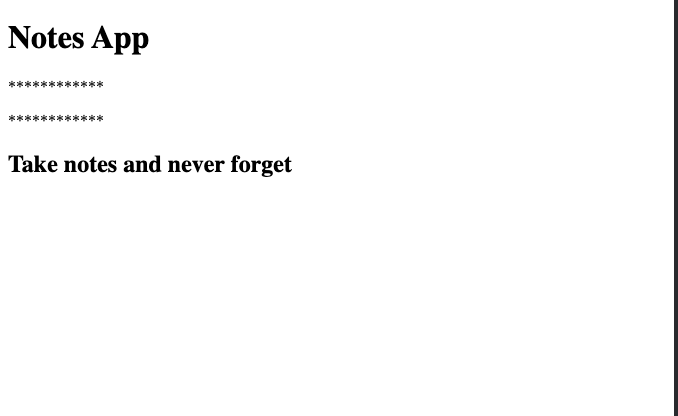

## Topics
In this section we are going to learn how to integrate javascript into the browser. Up untill now we've learned the basics of javascript running little script on our machine and that is a great way to get started.

But now that we know the fundamentals of the language we want to figure our how we can actually integrate this into a user interface to create an app that's meaningful for user to use.We're going to figure out how we can for example render thing in the browser based  of data in javascript and how we can respond to user interaction.

If someone clicks a button or submits a form with some data we want to be able to do something with that information from our javascript.

We're going to kick the section off by setting up a web server on your machine so we can actually serve up our little web sites.

## keywords & Notes

[HTML: HyperText Markup Language](https://developer.mozilla.org/en-US/docs/Web/HTML)
### Javascript in a Browser
This is going to allow us to change what the user sees or respond to thing like user clicks.To do this we are going to use the script tag 
from HTML.

[<script>: The Script element](https://developer.mozilla.org/en-US/docs/Web/HTML/Element/script)
The <script> HTML element is used to embed executable code or data; this is typically used to embed or refer to JavaScript code. The <script> element can also be used with other languages, such as WebGL's GLSL shader programming language and JSON.

[src](https://developer.mozilla.org/en-US/docs/Web/HTML/Element/script#attr-src)
This attribute specifies the URI of an external script; this can be used as an alternative to embedding a script directly within a document.

```
//Adding script tag on head tag of HTML, this is one way of adding Javascript.
<!DOCTYPE html>
<html lang="en">

<head>
    <meta charset="UTF-8">
    <meta http-equiv="X-UA-Compatible" content="IE=edge">
    <meta name="viewport" content="width=device-width, initial-scale=1.0">
    <title>Document</title>
    <script>
        console.log('This is from my HTML document')
    </script>
</head>

<body>
    <h1>Notes App</h1>

    <p>This appliation was created by Joseph Muganga</p>
    <h2>Take notes and never forget</h2>
</body>

</html>
```
> Another way of running javascript in a browser is to have a separated file which contain all of javascript code.

```
<head>
 
    <script src="./notes-app.js">
    </script>
</head>

<body>
  
</body>

</html>
```

### DOM Manipulation
So for in this section we learned a few important things. We learned how to create in HTML our document and we learned how to run a script by loading it into the document with a script tag.

> But we haven't' talked about is how to combine the two.How to do something with the documents inside of our javascript.For example listening for a button click or reading the text value in an element removing an element.

What we are going to do in this section is explore the DOM which stand for Document Object Model.So the document in DOM is the HTML document the object in DOM  is a javascript object.So we have an object in javascript that models the HTML documents that all the dogma's.

> So if I wanted to find all of my paragraph elements and get all of their text and see if there are any bad words in any of them I could use the DOM to do just that if I wanted to listen for a input fields of value to change I could use the DOM to do tht if I wanted to delete every single form from a web page I could use the DOM and to get that done anytime we're using javascript to do something with our HTML we're most likely going to be using the DOM. So we're going to kick thing off by figuring out how we can perform some basic DOM Manipulations.

The first thing that we're going to try to do is delete one of the elements in our document from our javascript file.I mentioned that the document is modeled using a javascript object and that objects is called document.This is not an object that we create.It's an object provided to us by the browser.We can use document to perform all of those DOM Manipulations.So if we were going to try to delete one of our elements let's say this paragraph tag for example.We can use document to perform all of those DOM manipulations.

So if were going to try to delete one of our elements let's say the paragraph tag for example. Well there are two steps 
* The first step is to get this element our of the document by querying it.So we're going to be able to search our document for various thing.
* The second step is what we want to do with the things we find.In this case we want to remove them.In other case we might want to update them or replace them.

#### How do we query our document for the various thing inside of it.
I'm going to kick this off by using one method on document, a very popular one this is `document.querySelector()`. It is called with a single value a string and in the method we define what we're looking for.In this case we're looking for a paragraph tag where we put inside of the quotes is actually the tag.Now what comes back from queries selector is a representation of not the whole document but a representation of just the element.So now all we need to do is just do something with the return value from query selector.

[Element.remove()](https://developer.mozilla.org/en-US/docs/Web/API/Element/remove)
The Element.remove() method removes the element from the tree it belongs to.

`Syntax`
remove()
```
const p = document.querySelector('p')
p.remove()
```

So this combination of querying the DOM and then using various methods is what we're going to do to manipulate our HTML from our javascript.I'm going to switch this back ovr to the paragraph and we're going to add another paragraph into the file.

`.querySelector` it matches the first match it finds, in this case it matched the first paragraph tag.

`.querySelectorAll()` it matches all the element specified, in this case it matches all the paragraph

```
//Query all and remove
const ps = document.querySelectorAll('p');
ps.forEach(function (p) {
    p.remove()
})

//Expected output: All the p element were deleted
```
`Element.textContent` provide access to text content of an element.

```
//Query all and remove
const ps = document.querySelectorAll('p');
ps.forEach(function (p) {
    console.log(p.textContent);
})

//Expected output:
This appliation was created by Joseph Muganga
Some note text
```
Now we can read the value off of text content but we could also write it as well.
```

//Query all and remove
const ps = document.querySelectorAll('p');
ps.forEach(function (p) {
  p.textContent = '************'
})
```
Expected output



```
//Query all and remove
const ps = document.querySelectorAll('p');
ps.forEach(function (p) {
  p.textContent = '************'
})
```
### Adding Element via the DOM
In this section we are going to learn how to add a new element to our HTML element to our HTML via the DOM.And this is going to be important because as we saw in the array's section the data for our application is going to be array of objects where each object represents the individual item whether it's an expense todo or a note it's going to be our job, the javascript developers to figure out how to render something new in the browser for each item.

> For example we might want to render a new paragraph tag for each todo and put little checkbox to it's left, for the note we're probably going to want to render two things the title and the body.

Either way we need to figure out how to add elements.

Step to add element 
* Create a element you want to add using `.createElement('p')`
* Update content of created Element for this case is a paragraph `newParagraph.textContent = 'Content'`
* Select the element of the parent element of where you want to put the new element `document.querySelector('body')`
* `.appendChild(newParagraph)`, append it to the parent Element
```
const newParagraph = document.createElement('p')
newParagraph.textContent = 'This is a new element from Javascript'
document.querySelector('body').appendChild(newParagraph)
```

This is the challenge exercise to display all of the todos which are incompleted
```
let todos = [{
    text: 'Order cat food',
    completed: false
}, {
    text: 'Clean Kitchen',
    completed: true
}, {
    text: 'Buy food',
    completed: true
}, {
    text: 'Do work',
    completed: false

}, {
    text: 'Exercise',
    completed: true
}]

let incompleteTodos = todos.filter((todo) => {
    return !todo.completed;
})

let body = document.querySelector('body');

let summary = document.createElement('h2');
summary.textContent = `You have ${incompleteTodos.length} todos Left`
body.appendChild(summary);

incompleteTodos.forEach((todo) => {
    const p = document.createElement('p');
    p.textContent = todo.text;
    body.appendChild(p)

})
```

### Handling User interactions
In this section ware finally going to cover user interaction.So if someone clicks a button and or types a new search string in the search field we should be able to do something in javascript based of that.

> So there are a lot of different events we can listen to.An event is something that the user does an event might be clicking a button or hovering a paragraph or scrolling on the screen.

All these events you can attach event listeners to, an event listener is nothing more than a function to run when the event happens.

so I can say hey when someone clicks this button run this function and that's exactly what we're going to set up.

When attaching an event listener to an element, we use an addEventListener() function.This addEventListener() function, it takes two argument, the first is a string and that's where you put an event name like `click` or `mouse up` or `change`.And the second argument is the function to run when that event happens.

Documentation: [EventTarget.addEventListener()](https://developer.mozilla.org/en-US/docs/Web/API/EventTarget/addEventListener)

An argument that passed to your callback function whenever you're listening for an event regardless of whether the event is click mouse up or any other event out there.You get your callback function you listener called with an argument.

This argument represent that event.So it gives you information about exactly what event happened and why.So this is really useful for us.

Now when we print `console.log(e)`, we're going to see just an overwhelming amount of information.And as with most of the things we've seen so far while there is a lot of information there's really only a few things that we're going to end up using.So you can found the (e) has more about 20 to 30 properties.

The most interesting thing is the `target` property, the target is actually a representation of the DOM element.So just like we can get the element back from query selector we can get the element that the event was fired on right here from `e.target`. That means we can do whatever we want.Like change the text of the element.

```
//Listent for a new todo creation
document.querySelector('button').addEventListener('click', function () {
    console.log('Button clicked')
})
```

### Advanced Queries
In this section we're going to learn a bit more about the different ways you can select elements from your document.

So currently we haven't had much trouble selecting the elements we're interested in working with.We select elements to remove, we read their values.

As we add more elements to the page we're going to run into issues we're selecting by tag isn't going to work very well.

So another way to select element in javascript is using `.querySelectorAll('tag')`
```
document.querySelectorAll('button')[1].addEventListener('click', function () {
  console.log('Delete all notes');
})
```
so imagine that I am UI designer and I come in and change the order of the buttons.The problem here is that the order is so important when using `.querySelectorAll()` and when we change the order of the elements this can be a problem.

So there is another way which is more specific way, we can get various elements on our pages as opposed to just targeting them by their tag name and then getting a big old list that works.

What we're going to use instead are `id's and classes`.
Well let's talk about the Id's and id is a way to get a unique identifier to each element on your page.It allows us to for example give a unique identifier to the button and then get targeted by its unique ID.

```
document.querySelector('#create-note').addEventListener('click', function (e) {
  e.target.textContent = 'The button was clicked';
})

document.querySelector('#remove-all').addEventListener('click', function () {
  console.log('Delete all notes');
})
```

> So by setting up those IDs over hee we're able to better target our stuff over here.Now if we were to switch the order again something that previously broke our event handlers we're going to see that they no longer break.

So we can use ID's or classes.ID's are unique to at most one element on your page.Classes can be held by multiple elements.So for example if I have a list of notes I might give each note a class of notes so I can target it easily from the javascript.

The difference between IDs and classes is not only can multiple elements have the same class,each elemtn can have as many classes as you need if you need a second one.

`querySelector()` is typically used with IDs because there's just one query selector.`querySelectorAll()` is typically used with classes because we're trying to get everything that has that class in here.

Now if you've worked with CSS before you should be familiar with this syntax (`.name,#name`).This is how we target stuff in CSS to apply style to it.We use the exact same patters in a querySelector() and querySelectorAll()

CSS tag selector
`Single`
* p - everything with p tag
* #replaced - an element with an id replaced
* .item - all element with class of item

We can actually change multiple things
`Multiple`
* p#order - paragraph with an id of order
* button.inventory - button with a class of inventory
* h1#title.inventory - h1 with id of tittle and class of inventory
* h1.application#title = h1 with a  class of application and id of title

### Text Inputs and Live Data filtering
In this section we are going to learn how to get text based input from the user so that user is going to be able to type something in the browser. And we're going to be able to get that data back and do something with it in our Javascript.

The input element is very flexible.There are all sorts of different types of inputs, we can work with the default one though is this text based input.Specifying the input type actually comes from the `type` attribute.

```
<input type="password">
<input type="text">
```

We might use it as the note title, the note body, the todo text or in this case we're going to use it as their search FILTER, allowing them to filter their notes by title or their todo's by todo text.

[<input>: The Input (Form Input) element](https://developer.mozilla.org/en-US/docs/Web/HTML/Element/input)
What we're going to explore is the input element, which is what we're going to use for various form fields like text based input and other like a checkbox.

So there are many event that you can use with input element, to check what is happening when you are interacting with it.Example of event are `input`, `change`

```
document.querySelector('#search-text').addEventListener('change', function (e) {
  console.log(e.target.value);
})
```

> So using the `change` event when you try to enter the value in a input, nothing changes but when you click away or remove the focus from this input the event actually fires.

So this type of event is very good when you want to capture the values after the user has remove the focus to an input, or click away. But when you need to capture value when user is entering data, the best event to use is 'input event.'

So this event will be fired each time the the use enter data, when  character is entered, the event will be fired or in other words, the event will be fired on every single character change.

So this will allow me to filter notes my dues or my expenses in real time as the user types.

There's another attibute for the input that's going to serve us well and this is the `placeholder attribute`.Another very common one for our text based inputs, placeholder allows us to provide a little smaple text input  when there is no value.

### Rendering our Filtered Data.
In this section we're going to render our data and filter it on the fly.
`HTML`
```
<body>
    <h1>Notes App</h1>
    <h2>Take notes and never forget</h2>

    <input type="text" name="" id="search-text" placeholder="filter todos">

    <div id="notes">
        
    </div>

    <button id="remove-all">Remove all notes</button>
    <button id="create-note">Create Note</button>

    <script src="./notes-app.js"></script>
</body>
```

`Javascript`
```
const notes = [{
  title: 'My next trip',
  body: 'I would like to go to Spain'
}, {
  title: 'Habits to work on',
  body: 'Exercise, Eating a bit better'
}, {
  title: 'Office modifications',
  body: 'Get a new seat'
}]

const filters = {
  searchText: ''
}
const renderNotes = function (notes, filters) {
  const filteredNotes = notes.filter(function (note) {
    return note.title.toLowerCase().includes(filters.searchText.toLowerCase())
  })
  document.querySelector('#notes').innerHTML = '';
  filteredNotes.forEach(function (note) {
    let noteEl = document.createElement('p');
    noteEl.textContent = note.title;
    document.querySelector('#notes').appendChild(noteEl);
  })
}

document.querySelector('#search-text').addEventListener('input', function (e) {
  filters.searchText = e.target.value;
  renderNotes(notes, filters)
})
```

### Todo Filter Challenge
> Challenge Tips
* Setup a div contain for todo
* Setup filters (searchText) and wire up a new filter input to change it
* Create a renderTodos function to render the latest filter data.

`HTML`
```<body>
    <h1>Todos</h1>
    <button id="add-todo">Add Todo</button>
    <input type="text" name="" id="typeTodo" placeholder="type your todo">
    <h2></h2>
    <div id="searchedTodo">
    </div>
    <script src="todos-app.js"></script>
</body>
```

`Javascript`
```
let todos = [{
    text: 'Order cat food',
    completed: false
}, {
    text: 'Clean Kitchen',
    completed: true
}, {
    text: 'Buy food',
    completed: true
}, {
    text: 'Do work',
    completed: false

}, {
    text: 'Exercise',
    completed: true
}]

let incompleteTodos = todos.filter((todo) => {
    return !todo.completed;
})

let body = document.querySelector('body');

let summary = document.createElement('h2');
summary.textContent = `You have ${incompleteTodos.length} todos Left`
body.appendChild(summary);

// incompleteTodos.forEach((todo) => {
//     const p = document.createElement('p');
//     p.textContent = todo.text;
//     body.appendChild(p)

// })
const filters = {
    searchText: ''
}

const renderTodos = function (todos, filters) {
    const filteredTodo = todos.filter(function (todo) {
        return todo.text.toLowerCase().includes(filters.searchText.toLowerCase())
    })
    const incompleteTodo = filteredTodo.filter((todo) => {
        return !todo.complete;
    })

    document.querySelector('#searchedTodo').innerHTML = '';

    incompleteTodo.forEach((todo) => {
        const todoEl = document.createElement(`p`);
        todoEl.textContent = todo.text;
        document.querySelector('#searchedTodo').appendChild(todoEl);


    })
```

### Working with form
> You can use `event.target.elements` to access all the elements withing the form.

`HTML`
```
    <form action="" id="form-name">

        <input type="text" name="firstName" id="" placeholder="First Name" id="firstName">
        <button>Submit</button>
    </form>
```
`Javascript`
```
 console.log(event.target.elements.firstName.value)

 Expected output:
 This will return the element with the name value of firstName which for this case is an input, so the value of it will be the value inserted in an input element.
```

`Challenge Code`
```
let todos = [{
    text: 'Order cat food',
    completed: false
}, {
    text: 'Clean Kitchen',
    completed: true
}, {
    text: 'Buy food',
    completed: true
}, {
    text: 'Do work',
    completed: false
}, {
    text: 'Exercise',
    completed: true
}]


//filter
const filters = {
    searchText: ''
}

//rendering todos
const renderTodos = function (todos, filters) {
    const filteredTodo = todos.filter(function (todo) {
        return todo.text.toLowerCase().includes(filters.searchText.toLowerCase())
    })
    const incompleteTodos = filteredTodo.filter((todo) => {
        return !todo.complete;
    })

    let searchedTodoDiv = document.querySelector('#searchedTodo');

    searchedTodoDiv.innerHTML = '';

    let summary = document.createElement('h2');
    summary.textContent = `You have ${incompleteTodos.length} todos Left`
    searchedTodoDiv.appendChild(summary);

    incompleteTodos.forEach((todo) => {
        const todoEl = document.createElement(`p`);
        todoEl.textContent = todo.text;
        searchedTodoDiv.appendChild(todoEl);

    })
}
renderTodos(todos, filters);

//filtering todos
document.querySelector('#filterTodoItems').addEventListener('input', (e) => {
    filters.searchText = e.target.value;
    renderTodos(todos, filters);
    // e.target.value = "";
})

//Add Todo Item
document.querySelector("form").addEventListener('submit', (e) => {
    e.preventDefault();
    todos.push({
        text: e.target.elements.todoText.value,
        complete: false
    })
    renderTodos(todos, filters);
    e.target.elements.todoText.value = '';

})
```
### Checkboxes
In this video we're going to learn about the checkbox and this is going to allow us to add things that need to either be true or false.

> When we first explored our text based inputs we saw that we had access to both `change` and `input`. And there was a clear advantage that `input` allowed us to get the new value on every key stroke as opposed to having to wait untill the user typed something and then clicked away.

But with checkboxes through we are just going to use the `change event` and it's going to fire as soon as the checkbox gets checked or unchecked over here.

> For a text based field for checkboxes we actually have a `checked` property and this is a boolean. So it's true if the checkbox is now checked.It's false if a checkbox is now unchecked.

```
let todos = [{
    text: 'Order cat food',
    completed: false
}, {
    text: 'Clean Kitchen',
    completed: true
}, {
    text: 'Buy food',
    completed: true
}, {
    text: 'Do work',
    completed: false
}, {
    text: 'Exercise',
    completed: true
}]


//filter
const filters = {
    searchText: '',
    hideCompleted: false
}

//rendering todos
const renderTodos = function (todos, filters) {

    //based on the search
    const filteredTodo = todos.filter(function (todo) {
        let searchMatch = todo.text.toLowerCase().includes(filters.searchText.toLowerCase())
        let hideCompletedMatch = !filters.hideCompleted || !todo.completed;
        return searchMatch && hideCompletedMatch;
    })


    const incompleteTodos = filteredTodo.filter((todo) => {
        return !todo.completed;
    })

    let searchedTodoDiv = document.querySelector('#searchedTodo');

    searchedTodoDiv.innerHTML = '';

    let summary = document.createElement('h2');
    summary.textContent = `You have ${incompleteTodos.length} todos Left`
    searchedTodoDiv.appendChild(summary);

    filteredTodo.forEach((todo) => {
        const todoEl = document.createElement(`p`);
        todoEl.textContent = todo.text;
        searchedTodoDiv.appendChild(todoEl);

    })
}
renderTodos(todos, filters);

//filtering todos
document.querySelector('#filterTodoItems').addEventListener('input', (e) => {
    filters.searchText = e.target.value;
    renderTodos(todos, filters);
    // e.target.value = "";
})

//Add Todo Item
document.querySelector("form").addEventListener('submit', (e) => {
    e.preventDefault();
    todos.push({
        text: e.target.elements.todoText.value,
        complete: false
    })
    renderTodos(todos, filters);
    e.target.elements.todoText.value = '';

})


document.querySelector('#hide-completed').addEventListener('change', (e) => {
    filters.hideCompleted = e.target.checked;
    renderTodos(todos, filters);
});

```


### Dropdowns
In this session which is the last section for this section, we will going to learn about select dropdown.So the dropdown is going to allow us to provide the user with multiple pre-configured options and they can pick one.

```
<!--html-->
    <select name="" id="filter-by">
        <option value="by-edited">Sort by last edited</option>
        <option value="by-created">Sort by recent created</option>
        <option value="alphabetical">Sort alphabetically</option>
    </select>
```

```
//js
//dropdown
document.querySelector('#filter-by').addEventListener('change', (e) => {
  console.log(e.target.value);
})
```

## Summary
On this section we have learned how Javascript is used in a Browser to enable user interactions, this includes event handling
