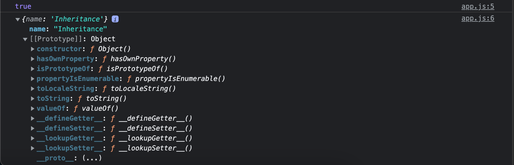

## Topic
> In this section we're going to take some time to start talking about a very popular programming topic that is object oriented programming.

We're going to see why it would be useful via a slide in this section. And then in the next several section we're actually going to implement into our javascript scripts.We'll see what javascript gives us to work with objects oriented programming.

> Let's take a look at these three words  `Object Oriented Programming` just means programming that's based around  some sort of concept. `Objects` are something we already know about.We've used objects dozens of times in class mode after real world things. We've used objects to model after a todo to model after a note to model after a person or a car.All of these can be modeled with various set of properties.

So objet oriented programming is actually going to look pretty similar to some of the stuff we've already been doing but with a slight twist.The twist is focussed on code `reusability`.

`Before`
```
const person = {
    firstName : 'Joseph',
    lastName : 'Muganga',
    age :54,
    getBio (){
        return `${this.firstName} is ${this.age}`
    }
}

const bio = person.getBio()
console.log(bio)

//Expected output: Joseph is 54
```

The thing  I want to talk about though is how we could  potentially reuse this. In image I needed a second person or a third or someone gave me a list and I had to generate a new person for each one to take advantage of those methods like get bio.Currently we do not have a good way to get this done.Well we're going to start talking about though is how we can get that done.

`After`
```
const person = new person('Ibra','Londezya', 54)
const bio = person.getBio()
console.log(bio)
```

What's different is on the below code, it's how we create the person using what we already know.We have to literally define this person object every single time we have to set up all of the data fields.

Using what we're about to learn we can create a function that serves as a template.It allows us to easily generate new people and reuse the various pieces of functionality like the method get bio. We do not have to redefine everything for each person we want.This is going to be a great way to structure our code.

```
const person1 = new person('Joseph','Muganga', 64)
const person2 = new person('Ibrahim','Samson', 28)

const bio1 = person1.getBio()
console.log(bio)

const bio2 = person2.getBio()
```

Based on the code above, we really have two people here we have a person one and we have a person two.

Now when we make a new version of something we call that an instance.So if I'm making a new car I would say I have an instance of car If I'm making a new person I could say I have an instance of person in this case I have two person instances.

Now what you'll notice about each person is that they come with a standard set of values we have attributes, like firstName, lastName and age.We have that for all people.

So every person we create is going to have access to the same set of methods.These methods are going to work with the instance data.

## Keywords & Notes
### Constructor Function
```
const person = function (){

}
const me = new person()

console.log(me)`

//Expected output:person {}

```
And this is our very first custom object type.The object type gets its name from the function.And currently we haven't set any values.That's why there's nothing showing up right here.

What we've done is we've created what's known as a constructor function, functions that get used with `new operator are constructor functions`, the constructor function itself is where we can initialize the data for our object. 

So as I mentioned the last section all of our instances are going to have the same attributes for a person, first name, last name, age for a car might be color, year and make model.It's not the list of attributes that differs.It is the values for those attributes.And this the constructor function is where all of that gets set up.

Now before we go any further I want to talk about why we're getting very different results in the terminal, even though the only change we made was adding on the `new operator` behind the scenes the new operator.Behind the scenes what the new operator does a few very important things.

The first thing it does is it generates a new empty object for this new instance then it gives us access to that empty object in the constructor function via the this value.

Now the only time we've used `this` before is when we've created  methods function on our objects. Well this also comes up again inside of our constructor functions. In this case `this` refers to the new empty object.

```
const person = function (){
    console.log(this)
}
const me = new person()

console.log(me)

//Expected output:
person {}
person {}
```

We're going to get he same output twice.

```
const person = function (){
   this.firstName = 'Andrew'

}
const me = new person()

console.log(me)

//Expected output:
person { firstName: 'Andrew' }
```

We have used the constructor function to create a new instance of person in and we've also customized it a little bit.But clearly this data isn't going to come from the constructor function itself.Otherwise all instances of person would have the same first name.Instead this is going to come from function arguments.

```
const person = function (firstName){
   this.firstName = firstName

}
const me = new person('Andrew')

console.log(me)

//Expected output:
person { firstName: 'Andrew' }
```

Now we'll be able to make multiple instance of person providing a unique first name for each.

Anytime we define a constructor function we're going to be using an uppercase p.This convention just makes it a bit more obvious that the function is supposed to be called with the new operator.Since we are creating a constructor function we're going to stick with that capital P.

```
const Person = function (firstName){
   this.firstName = firstName

}
const me = new person('Andrew')

console.log(me)
```

There is no need to return anything from the constructor function.This is another thing that the new operator does it creates that new object and it also uses it as the return value implicitly.Now we could override that by explicitly using return above but this is not recommended and there is almost zero reason to ever do so.

The whole point of the constructor function is to set up that unique object and then get access to it.So we want to leave return off from our constructor function.

```
const Person = function (firstName, lastName, age) {
    this.firstName = firstName
    this.lastName = lastName
    this.age = age

}
const me = new Person('Andrew', 'Muganga', 35)

console.log(me)

//Expected output:
Person { firstName: 'Andrew', lastName: 'Muganga', age: 35 }
```

```
me.firstName = "Joseph"
```
Let add another person

```
const Person = function (firstName, lastName, age) {
    this.firstName = firstName
    this.lastName = lastName
    this.age = age

}
const me = new Person('Andrew', 'Muganga', 35)
console.log(me)

const person2 = new Person('Anna','Peter', 51)
console.log(person2)

//Expected output:
Person { firstName: 'Andrew', lastName: 'Muganga', age: 35 }
Person { firstName: 'Anna', lastName: 'Peter', age: 51 }
```

And when we do so we now see we have two instance of our object of type person.The first represents that first person with a different set of values.And the second represent that second person both have the same attributes firstName, lastName and age.

So remember `arrow function` don't bind this. We need access to this to customize the instance of the hang man game.

### Setting up the Prototype Object
> We have our constructor function in place allowing us to generate that unique object.And in the above case we've generated two of them.

What I want to talk about now is not what makes each person unique but what's the same.And for this it is going to be a set of methods that are shared amongst all instance of person.So we're going to be setting up a little `inheritance` because you're an instance of person you're going to inherit certain behavior. 

There are certain things related to all people and that is exactly what we're going to end up defining.Now when we talk about this idea of inheritance allowing instances of the constructor function some sort of unique shared behavior.

What we're really using in javascript is known as `Prototype inheritance`. `Prototype inheritance` is a form of inheritance.

So we're going to go ahead and figure out how to add a method onto me and person to both being instances of person to do this. All we have to do is add a little configuration to our constructor function.

Prototype is an object on this object.We put everything that we want to share with the instances of this constructor function.So if I want all of those instance to be able to access some sort of method I provide that method right in a prototype.

Let's say that we want to call the method get bio.
```
//Prototype Inheritance
const Person = function (firstName, lastName, age) {
    this.firstName = firstName
    this.lastName = lastName
    this.age = age
}

Person.prototype.getBio = function () {
    return `${this.firstName} is ${this.age}`

}

const me = new Person('Andrew', 'Mead', 27)
console.log(me.getBio())

const person2 = new Person('Clancey', 'Turner', 51)
console.log(person2.getBio())

//Expected output:
Andrew is 27
Clancey is 51
```
Now what we've successfully done is we've set up a method that is shared with all of these instances.This is how we're going to set up those methods things that are the same for all people or in the case of some sort of  other constructor function methods that are the same for all instances of a hangman game.

It's important to note that there is no restriction on these values being functions.So if I create a property on the prototype object I can assign it a value of any type I like. So typically there's not much of a purpose to that.So we're mostly going to see just functions set up on prototype because there's no other static data that we would want to share.

But it would indeed work if I were to set up `Person.prototype.location= Thailand`. and that is indeed going to shared with all instances of the constructor function.
```
const Person = function (firstName, lastName, age) {
    this.firstName = firstName
    this.lastName = lastName
    this.age = age
}

Person.prototype.getBio = function () {
    return `${this.firstName} is ${this.age}`

}
Person.prototype.location = 'Thailand'

const me = new Person('Andrew', 'Mead', 27)
console.log(me.location)

const person2 = new Person('Clancey', 'Turner', 51)
console.log(person2.location)
```

So now all instances of person `me and person` have access to this `location property`.But once again it doesn't typically serve much of a purpose.If we have some static data it's likely going to be configured for each individual person meaning that it would show up up above.

Let's go ahead and get rid of this not so useful location and set up something a bit more useful (setName())

```
const Person = function (firstName, lastName, age) {
    this.firstName = firstName
    this.lastName = lastName
    this.age = age
}

Person.prototype.getBio = function () {
    return `${this.firstName} is ${this.age}`

}
Person.prototype.setName = function (fullName){
    const names = fullName.split(' ')
    this.firstName = names[0]
    this.lastName = names[1]

}
Person.prototype.location = 'Thailand'

const me = new Person('Andrew', 'Mead', 27)
me.setName('Alex Turner')
console.log(me.getBio())

const person2 = new Person('Clancey', 'Turner', 51)
console.log(person2.getBio())
```
So were able to successfully split apart the full name.Getting the individual components out of it.

```
const Person = function (firstName, lastName, age,likes) {
    this.firstName = firstName
    this.lastName = lastName
    this.age = age
    this.likes = likes
}

Person.prototype.getBio = function () {
    let bio = `${this.firstName} is ${this.age} `
    if(this.likes){
        this.likes.forEach(like => {
            bio += `${this.firstName} likes ${like}.`
            
        });
    }
  
    return bio

}
Person.prototype.setName = function (fullName){
    const names = fullName.split(' ')
    this.firstName = names[0]
    this.lastName = names[1]

}


const me = new Person('Andrew', 'Mead', 27,['Teaching','Biking'])
me.setName('Alex Turner')
console.log(me.getBio())

const person2 = new Person('Clancey', 'Turner', 51)
console.log(person2.getBio())

Expected output:
Alex is 27 Alex likes Teaching.Alex likes Biking.
Clancey is 51 
```
Well arrow functions don't binding `this` value so it uses whatever this value it's parent  has.The parent has the correct `this` value for the instance we're able to access `this.firstName` up here we're able to access this.firstName  in the foreach.

> We've covered a little bit of ground in this section we learned how we can set up methods for the instances of our constructors functions and that's allowing us to reuse code. We have the exact same two methods available to all instances of person.

```
const Hangman = function (word, remainingGuesses) {
    this.word = word.toLowerCase().split('')
    this.guessedLetters = ['c']
    this.remainingGuesses = this.remainingGuesses

}
Hangman.prototype.getPuzzle = function () {
    let puzzle = ''
    console.log(this.word)
    this.word.forEach((letter) => {
        if (this.guessedLetters.includes(letter) || letter === ' ') {
            puzzle += letter
        } else {
            puzzle += '*'
        }
    })
    return puzzle
}

const guess1 = new Hangman('cat', 2)
guess1.guessedLetters.push('a')
console.log(guess1.getPuzzle())

const guess2 = new Hangman('New Jersey', 6)
guess2.guessedLetters.push('e')

console.log(guess2.getPuzzle())
// console.log(guess2.word)
```
### Digging Into Prototypical Inheritance
In this section we'll go through visualization of what's happening and then we'll get back into the code and experiment.

So right above we have our person constructor the person constructor function has the prototype property and on that prototype we chose to set up two things in this example getBio and setName.This is the stuff that we already have in place.

Now we also know how we can create multiple instances of person by using the `new operator` with the constructor.We can create one instance of person over here called Clancey. We can create another instance over here called Alexis.

Now what we don't know is how these end up getting linked to the prototype property.All I know is that if I create a new person I have access to `getBio and setName` what's actually happening though is pretty interesting.

So the above picture is not an accurate depiction of what's actually going on here.Right now we just have a generic arrow pointing from one thing to another.Let's go ahead and replace this person instance with a more depiction of how the relationship is set up. So I'm going to remove everything from the left hand side although I'll keep stuff on the right hand side so we can compare and contrast what's really happening is very similar but with one missing detail.


Right above we have a more accurate picture of what's happening when we're using javascript and prototype inheritance. NOw on the first object we still have the properties we set up.We still have firstName,lastName and age.These are things that we as the developer created down below though we have something brand new.This is known as the prototype property.The prototype property is a property for internal use only.Meaning that you're not going to see it if you try to access it on the object.

But this is what creates the relationship between your instances and the methods that were able to access.So the same thing is true with the other instance obviously.


> All of the instances have a prototype property that is what links them to the shared set of methods.

Now let's go ahead and wrap up the slide by taking a look at a code example and figuring out how it  fits in with the visualization up above.

```
const me = new Person('Clarency','Turner',54)
// me.[[prototype]] = Person.prototype

console.log(me.firstName)

const bio = me.getBio()
console.log(bio)

console.log(me.testing)

//Expected output:
Clarency
Clarency is 54 
```

I want to kick things off by talking about that person prototype object a bit more.We know that all of our instances in this case `me and person` link to that `person prototype object`

> It's important to note that any changes made to that object will be reflected in all of our instances, even if the change is made after the instances is created.

The reason that I'm bringing up this is because it works a bit differently than other languages.So if you come from a Java language background or a C++ background you actually do have things copied over as the instance is created. This is not the case with javascript.It simply links to the prototype.Any change made to the prototype will be reflected in every single instance.

The one thing I want to explore is that `property shadowing` we were talking about where if a property exists on the instance it's going to be used even if it also exists on the prototype to see this we're going to do is tweak me.

```
const me = new Person('Andrew', 'Mead', 27,['Teaching','Biking'])

me.getBio = function(){
    return 'Testing is fake'
}

//Expected output:
Testing is fake
Clancey is 51 
```
As you my have suspected we're getting `This is fake` for the first time and we're getting `Clancy is 51` for the second.So in this case we are setting up a new property on our instance.So when we access `getbio()` it first looks on `me`.Does it exist? Yes it does.So it uses that function and never gets a chance to go up the prototype chain.

> Now it's important to note that the change we made to `me` had no effect on `person2`.This is a completely separate  instance.So by setting the instance property up above for this one we are not changing the behavior down below.

We are still able to correctly call getBio() seeing our message since we've never set up the getBio() instance property the only one we have is on the prototype for this example. So it first looks for person2.Does it have getBio()? Nope.So it goes up that prototype chain and looks at person.prototype.So it goes ahead and it uses that function.

> Now a lot of the stuff that we just explored isn't necessarily going to come up, Day to Day typically we are not going to find ourselves taking advantages of features like this for features of changing the prototype after instances are created.All of that is explained just go give you a complete picture.

It's important to know.Otherwise you might run up against some very strange issues code that would seem to work one way, works another way.

In the beginning of the section, I also mentioned that another interesting thing about prototype inheritance and why it's important to know is that it's used extensively behind the scenes by the language. for example down below we're created plenty of string before I might have a string Andrew.

```
'Andrew'.toLowerCase()

//Expected output:
andrew
```
The question is how are we able to access using dot notation a method on a string, when typically this is reserved for objects?Well the truth is that almost everything is indeed an object in Javascript. 

So we're going to go ahead and jump right into the next section and see exactly what the means and how it plays out.By the end you'll understand exactly how code like this actually works.

### Primitives and Object Part I
In this section we're going to talk about primitive values and objects in javascript and we're going to see how all of that relates to prototype inheritance.

Now we've already spent plenty of time talking about objects and we know how they work but we're going to see them in a completely new light.

I've never mentioned the word primitive before.So we'll be discussing exactly what those are as well.And the good news is that there are already things you're familiar.

What I really want to talk about is what happens when we have things like `'Andrew'.split()` when we have a string and then we access what looks like an object.It's not quite clear what's going on behind the scenes and how all of this relates to prototype inheritance.

```
const product = {
    name:'Inheritance'
}

console.log(product.hasOwnProperty('name'))

//Expected output:
false
```
So clearly hasOwnProperty() does indeed seem to function correctly.Another question has to be asked Why is it called hasOwnProperty(). Why not just Property to start exploring this and to uncover what I really want to talk about.

Let's take this method name ('hasOwnProperty`), then past it as the thing we're searching for.If we run this code we're actually going to get `false` which doesn't really make sense. Since we know that hasOwnProperty exists the function is running. So we're basically checking if the function we're running exists and we're getting back `false` meaning that the code should fail.It should say that the function doesn't exist when we try to call things.

```
const product = {
    name:'Inheritance'
}

console.log(product.hasOwnProperty('name'))

//Expected output:
true
```
This is very confusing behavior but to uncover what's really happening and to have all of this make a lot of sense.But we're going to do is pull up the documentation for hasOwnProperty over here in the browser.

And you'll notice something right away about that title its `Object.prototype.hasOwnProperty()`. So internally when we're using these data type we've been exploring we are accessing those shared methods
like filter(), split() and other such as hasOwnProperty() via prototype inheritance

> Now as we saw in the slide for the last section with one of our other examples for example one of the person instances we first look for thing on the instance itself.If we don't find it there we look for it on person prototype.If we don't find it there then it's nowhere.And then we get `undefined` the same thing is true over here.

But with a prototype that we did not create one that's built in to the language.So we start by looking at product does product have what we're looking for.If it does great that's what we want.If not we actually continue up the prototype chain using that internal prototype property. This time though the thing that we get linked to isn't something we created it is object.prototype.

```
product --> Object.prototype
```

> Now object.prototype is where methods like hasOwnProperty lives.So that's why we're able to access them on our object product even though the only thing we've set up is the property name.

```
product --> Object.prototype --> null
```
Now technically object prototype also has a prototype values as well.And this prototype value is just null.This means the chain ends.So we search at 'product' if we find it great. If not we search in Object.prototype , if we find it great if not then we search 'null' and we're never going to find it on null. So the chain ends and we stop looking for more stuff.

So this is completely accurate depiction of why code like this runs.Now we can figure out why it's hasOwnProperty instead of hasProperty.

Using the browser we can actually visually explore the prototype chain for anything by duping it to console. if we console.log the product itself, what we get over in the second output we have our object

```
const product = {
    name:'Inheritance'
}

console.log(product.hasOwnProperty('name'))
console.log(product)

//Expected output:
true
app.js:6 {name: 'Inheritance'}
```


It first started with constructor function name.In the case of person it was uppercase P person and then we had our curly braces and in there we had all of the instance properties we set up the same thing is true with object because by suing this notation, we've successfully created a new instance of Object.

> Now if we expand that what do we see we see name which we set up.Now in previous section I had mentioned that the thing that links your instance to the prototype property is 'prototype' it was two opening brackets upper case the prototype two closing brackets.And that is true but that's for internal use only the browser exposes this property.So you can view the prototype chain although we're never going to manually manipulate it. And very rarely actually never will we ever use it in our code but it does serve a great purpose when it comes to exploring how things work.

If we expand this what do we see we see we get an object with various properties on it.One of them being the method we just used hasOwnProperty.

Now we can go ahead and take this one step further.Does this thing `__proto__`that start at define getter and end at a value of have.And the answer is No.

We access `product.__proto__` what do we get? We get the object prototype.I'm going to reload that last command using the up arrow.`product.__proto__.__proto__` and what we will get is `null`.Here we can see that prototype chain in action.This is exactly what's happening when we create product.And we tried to access properties on it.

```
product.__proto__.__proto__
```
Now much like we can change a a person prototype and hangman that prototype to customize the behavior of the instances we actually can change object prototype.We could add new methods on or we could override existing ones. This is generally a horrible idea and you're never actually going to do it but it is going to help us explore how all of this works.

So for example we have `object.prototype` and I can indeed set something on there.Let's actually override `hasOwnProperty()` the one method we're currently using. All I'm going to do is set this up to be a function  I'll use the shorthand arrow function syntax and we're just going to return a string.

```
const product = {
    name: 'Inheritance'
}
Object.prototype.hasOwnProperty = () => 'This is the new function'


//hasOwnProperty
console.log(product.hasOwnProperty('name'))

//Expected output
This is the new function
```
We could also add a brand new method onto al of our objects some new method.Now we're going to be able to access that on every single object we work with.So down here for example I could replace hasOwnProperty with a call to some new method and just like we got before we're going to see our string print.

```
const product = {
    name: 'Inheritance'
}
Object.prototype.someNewMethod = () => 'This is the new function'


//someNewMethod
console.log(product.someNewMethod('name'))

//Expected output:
This is the new function
```

There's one last thing about this example which does not make sense.Typically when we wanted to use prototype inheritance we had to use the new operator with our constructor. Typically when we wanted to use prototype inheritance we had to use the new operator with our constructor function.

But at no point we have used the new operator with the constructor function.Well this is because how we're creating the object here this is known as a `literal syntax` when the syntax of the language allows us to define a value of a specific type using a series of characters.

Those series of characters would be the opening and closing braces with our name on the left hand side.The language is able to see the syntax and interpret it.Knowing what we're really trying to do is create a new object.So it handles that for us behind the scenes.That's why we do not have the new operator and we do not use the object constructor function.

This is not to say there is no object constructor function because there is, right here we can remove

```
const product = new Object()
product.name = 'Rest'
Object.prototype.someNewMethod = () => 'This is the new function'


//someNewMethod
console.log(product.someNewMethod('name'))
console.log(product)

//Expected output:
This is the new function
{name: 'Rest'}
```

We're going to see exactly what we had before just the value for the name property has changed.It's still an object.It just been created using a completely different syntax.

The above code we are explicitly using new with the constructor function as opposed to having that implicitly done behind the scenes when we use the literal syntax.Now you can initialize objects with values if you're using the constructor function.All we do is we provide the object as the first and only argument so we could say we want to start off with a name property and then we can just pick a different book that I've rea recently.

So those are all different ways we can create object in javascript though we're never going to use this syntax for getting it done.Since we have the object literal syntax since it is a built in type the language knows what to do with those series of characters which means that we can avoid stuff like this.

We've seen what goes on behind the scenes for those built in types.In the next section we're going to see how the same thing applies to all of the other types in the language.

But understanding how this works is super important.

```
const product = new Object()
product.name = 'Rest'
Object.prototype.someNewMethod = () => 'This is the new function'


//someNewMethod
console.log(product.someNewMethod('name'))
console.log(product)

//Expected output
This is the new function
{ name: 'Rest' }
```

### Primitive and Objects
As you've likely guessed by now objects are not the only type in javascript that are taking advantage of prototype inheritance, all of the other types are as well.This is why on our arrays we have access to the filter method and it's why an all of our strings we have access to methods like includes.

> So in this section we're going to analyze the prototype chain for all of those other types.We already went through the process once it took quite some time but going through it again is going to be much easier now that we know what we're looking for.

To kick this section off I actually want to start by defining a term and I'm going to do that with a comment.

>Primitive value: Is a values that does not have properties it is not an object.There are five primitive values in javascript all of which we've already learned a whole bunch about. We have a string, number, Boolean, null and we have undefined. 

Anything not in this list is an object. Other things includes object but it also includes other things w might not have expected, like arrays and functions.

> We're going to look at how arrays and functions use prototypes inheritance to allow us access that shared set of functionality.

```
const team = ['like', 'Maddison']
console.log(team)

//Expected output:
(2) ['like', 'Maddison']
0: "like"
1: "Maddison"
length: 2
[[Prototype]]: Array(0)
    at: ƒ at()
    concat: ƒ concat()
    constructor: ƒ Array()
    copyWithin: ƒ copyWithin()
    entries: ƒ entries()
    [[Prototype]]: Object
        findLastIndex: ƒ findLastIndex()
        flat: ƒ flat()
        flatMap: ƒ flatMap()
        forEach: ƒ forEach()
        includes: ƒ includes()
        indexOf: ƒ indexOf()

```

> Array Object chain
```
//Array: myArray -->. Array.prototype --> Object.prototype --> null
```
So when I say that an array is technically an object this is what I'm talking about.The array is nothing more than a customized version of an object. Down below we can prove this by accessing our array hasOwnProperty() something that we know is available  on objects but that we might not think  is available on arrays.

```
const team = ['like', 'Maddison']
console.log(team)

console.log(team.hasOwnProperty('length'))
console.log(team.hasOwnProperty('filter'))

//Expected output: 
true
false
```
It is false cause if we check for something else like `filter` we're going to get false. Because array have filter, yes they do. But they come from `Array.prototype`.They are not on the array itself. 

There is also a constructor function for arrays, we use that to generate an array not using the literal syntax that looks a little bit like below.

```
const team = new Array(['Luke','Medddison'])
console.log(team.hasOwnProperty('filter'))

//Expected output:
false
```
Now as I mentioned before I very rarely basically never are we going to use this syntax with the constructor function.When we create array we're always going to use that literal syntax.

Now we can move on to the next type that we're going to explore.That is the function. So let go ahead and make a function and then dump it to the console function. 

```
const getScore = () => 1
console.log(getScore)


//Expected output:
function getScore()
    length: 0
    name: "getScore"
    <prototype>: function ()
        apply: function apply()
        ​arguments: 
        bind: function bind()
        call: function call()
        ​​caller: 
```

We can see we have our function showing up and on there we have a few different properties.We also have a proto property which links to function.And this is where we get access to all of these shared behaviors from functions.There are some methods listed here that we will eventually explore. And of course this also has a proto property which links to object and we know that object links to null.

So here is the prototype chain for a function.
```
//Function: myFunc --> Function.prototype --> Object.prototype --> null
```
So when I say that arrays and functions are object this is what I'm talking about.Yest they do have customized behavior that comes from array of prototype and function prototype.But in the end of the day both of them are just a modified version of an object.


> And now I want to turn our attention towards the primitive above.We've taken care of everything else up here through we have string, number, boolean , null and undefined.Now there are two groups here.

The first group is null and undefined. These are truly primitive values we will never access a property or methods on them but with string, number and boolean it's a little different because we know that we've definitely accessed properties on our strings, just section ago we learned about and used the split method to convert a string to an array.

> So how can I say that at the same time a string has a method but also is not a object.To explain this behavior we're going to dive in to a example.

```
const product = 'Computer'
console.log(product)

//Expected output:
Computer
```

We get computer printing on a console.But your'e going to notice it is not something that you can expend.I can't look at all of its properties and the prototype chain because it is a non object.It just has the value computer.

But I will explain the behavior of calling `product.split` and actually getting the correct results.If I save the file over in the browser I do indeed get the array as expected as opposed to some sort of error saying `I'm trying to access a property on a primitive`.

```
const product = 'Computer'
console.log(product.split())

//Expected output:
Array [ "Computer" ]
0: "Computer"
length: 1
<prototype>: Array []
```

What's happening here is that behind the scenes when we access a property on our string it converts it to an object.So strings, numbers and booleans are indeed primitives but they have what's known as an object wrapper. This object wrapper is what gives it all of functionality that we're seeing here.For example the `split method for a string`.

So let's take a look at the code below.`we're going to create another string other than product.`

```
const product = 'Computer'
console.log(product.split())

const otherProduct = new String('Phone')
console.log(otherProduct)

//Expected output:
Array [ "Computer" ]
String { "Phone" }
    0: "P"
    1: "h"
    2: "o"
    3: "n"
    4: "e"
    length: 5
<prototype>: String { "" }
    anchor: function anchor()
    at: function at()
    big: function big()
    blink: function blink()
    bold: function bold()
    charAt: function charAt()
    charCodeAt: function charCode
​<prototype>: Object { … }
    ​__defineGetter__: function __defineGetter__()
    ​​__defineSetter__: function __defineSetter__()
    ​​​__lookupGetter__: function __lookupGetter__()
    ​__lookupSetter__: function __lookupSetter__()
    ​​​__proto__: 


```

Over in the browser we have our primitive computer up above down below we have our string phone. This time we can expand it.We can look at all of its properties all of the individual characters and we can also look at its proto prop which is string now string contains all of these string methods we've used before.

Prototype which is string now string contains all of these string methods we've used before.If we scroll down we can view all of them including the one that we just used.Split is defined right down here.

So behind the scenes when we tried to access a method on a string primitive it converts it into an object.It then calls the method on that and it gives you the values back in our code we're never going to create a string using this technique.Instead we'll just use the primitive value and will allow javascript to do the conversion for us.

Now down below if we continue to look at the proto properties for our string we have a prototype property for this one and this is an object. So this is why strings can be classified as objects as well.

```
String: myString --> String.prototype --> Object.prototype --> null
```

We have our string prototype chain set up for numbers and booleans. It is the exact same thing.We had that same conversion process happening behind the scenes. 

So right here for a number we have my number.
```
Number. myNumber --> Number.prototype --> Object.prototype --> null
```

And here we have a prototype chain for a boolean.
```
Boolean: myBoolean --> Boolean.prototype --> Object.prototype --> null
```

> This is the prototype chain for all of those internal types we've explored so far and this now explains exactly what happens when we access a method on a string which otherwise wouldn't seem to be able to have a method defined on it.It gets implicitly converted to an object behind the scenes by javascript. It then calls that method allowing us to do whatever we want, whether it's split up a string or see if a string contains another string inside of it.

If you did around the web long enough looking at articles about prototype inheritance eventually you're going to hear someone say that everything in javascript is an object.They're kind of right but not quite.There are primitive values even though some of these are primitive values do have object counterparts but null and undefined will never end up being objects.

So while it seems most thing in javascript are objects it's not quite true.Now it's also important to understand that what we're learning here is just describing what's going on behind the scenes because of the thing we've learned in the last two sections.


### Hangman Challenge Part II
>  Next logical features to add is the ability for a player to actually make a guess. Right now all of the guesses are hard coded in the constructor function [this.guessedLetters = ['c','e']]. Our games are actually going to start off  with no guesses and we're going to have a method that allows a user to make guesses over time.

```
//Create a method for making a guess
//1. Should accept a character for guessing
//2. Should add uniques guesses to list of guesses
//3. Should decrement the guesses left if a unique guess isn't a match

const Hangman = function (word, remainingGuesses) {
    this.word = word.toLowerCase().split('')
    this.guessedLetters = []
    this.remainingGuesses = remainingGuesses

}
Hangman.prototype.getPuzzle = function () {
    let puzzle = ''
    
    this.word.forEach((letter) => {
        if (this.guessedLetters.includes(letter) || letter === ' ') {
            puzzle += letter
        } else {
            puzzle += '*'
          
        }
    })
    return puzzle
}
//method to make a guess
Hangman.prototype.makeGuess = function (guess){
    //converting a guess to lowerCase
    guess = guess.toLowerCase()
    //checking if the input guess is unique ( not being submitted before)
    const isUnique = !this.guessedLetters.includes(guess)
    //checking if a guess is a bad guess
    const isBadGuess = !this.word.includes(guess)

    if(isUnique){
        //if the guess is uniques push it to guessedLetters array
        this.guessedLetters.push(guess)
    }
    /**
     * checking if it's unique and it's a bad guess 
     * [ does the guess exist in the actual word array]
     * if we have a bad guess and it's a unique bad guess
     * we are going to decrement remaining guess by 1
     */
    if(isUnique && isBadGuess){
        this.remainingGuesses--
    }
}
const guess1 = new Hangman('cat', 2)
//Guess c, t, z
// guess1.guessedLetters.push('a')
console.log(guess1.getPuzzle()) // c*t
//Print remaining guesses (should be 1)
console.log(guess1.remainingGuesses)

/**
 * Adding event Listener to listen for a guess
 * when keys on keyboard are pressed, and this is going to fire
 * when someone presses a key on a keyboard, that would
 * actually reveal a character, so think about letters and numbers and 
 * not things like the shift key or the cap locks key.
 * 
 * And on that event object we get access to a property called charCode 
 * (Character code), this is what allows us to figure out which key
 * was pressed
 */
window.addEventListener('keypress',(e)=>{
    /**
     * We have a charCode for each keyboard letters, which are numbers,
     * but these aren't particularly useful for us since what we 
     * want is letters.
     * I want the actual letter not the character code.
     * There is a method that allows us to get this code.
     * The method is .fromCharCode()
     */
    const guess = String.fromCharCode(e.charCode)
    guess1.makeGuess(guess)
    console.log(guess1.getPuzzle()) // c*t
    console.log(guess1.remainingGuesses)

})
```

### Hangman Challenge Part III
> In this section we're going to continue on with the Hangman game and the focus for this challenge is going to be getting things rendered to the browser window.Right now all of the input and output for the game is sitting in the console and that's pretty useless. 
>
> So let's go ahead and scroll up to the top.
>
It is not good to try to solve multiple problems in one function. It's best to break that out into ints own method.

```
//1. Display the puzzle to the browser instead of the console.
//2. Display the guesses left to the browser instead of console.
//3. Separate the Hangman definition from the rest of the app code (use app.js)

/**
 * And now I want to get into the second and final challenge
 * for this section and this is where we're going to figure out if the 
 * user finished the game, if they finished the game successfully by guessing
 * all the letters before their guesses ran out or if they finished
 * the game by failing running out of guesses before they guessed all 
 * of the letters. Step below
 */

// 1. Setup new 'status' property with initial value of 'playing'
// 2. Create method for recalculating status to 'playing' ,'finished' or 'failed
// 3. Call that methods after a guess is processed
// 4. Use console.log to print the status

// Start the game and see 'playing'
// Make two incorrect guesses to see 'failed'
// Refresh the browser and guess 'c', 'a' and 't' to see 'finished'

const Hangman = function (word, remainingGuesses) {
    this.word = word.toLowerCase().split('')
    this.guessedLetters = []
    this.remainingGuesses = remainingGuesses
    this.status = 'playing'

}
Hangman.prototype.getPuzzle = function () {
    let puzzle = ''
    
    this.word.forEach((letter) => {
        if (this.guessedLetters.includes(letter) || letter === ' ') {
            puzzle += letter
        } else {
            puzzle += '*'
          
        }
    })
    return puzzle
}
//method to make a guess
Hangman.prototype.makeGuess = function (guess){
 
    guess = guess.toLowerCase()
    const isUnique = !this.guessedLetters.includes(guess)
    const isBadGuess = !this.word.includes(guess)

    if(isUnique){
        this.guessedLetters.push(guess)
    }
  
    if(isUnique && isBadGuess){
        this.remainingGuesses--
    }
    this. calculateStatus()
}

//method to check the status of the game
Hangman.prototype.calculateStatus = function (){
 
        let finished = true

        this.word.forEach((letter)=>{
        /**
         * Check if it contains using includes method 
         * If it does contain that letter then we're good to go.
         * We're not actually going to change the finished value at all
         * It's only if at some point we run across a single letter that is not in guessed letter,
         * then at that point we consider this a failure
         * 
         * `finished = true` The problem with this is that a long as the 
         * last letter in a word was guessed finished is going to end 
         * up being true
         * 
         * So we don't want to update things to true at all. We're only going to 
         * switch things to false if at any point in our iteration we actually
         * run into something that has not been guessed a single thing 
         * that hasn't been guessed is enough to cause the whole puzzle to not
         * be considered finished.
         */


        if(this.guessedLetters.includes(letter)){
            //finished = true

        }else{
            finished = false
        }
    })

     if( this.remainingGuesses === 0){
         this.status = 'failed'
     }else if(finished){
         this.status = 'finished'
     }else{
        this.status = 'playing'
     }
}


    /**
     * Couple of different ways we could have approached the problem of calculating 
     * whether or not the puzzle has been finished.
     * An alternative way we could have solved this was using the filter method 
     * I could have filtered out all of the letters that have been guests 
     * leaving just the ones that have not been guessed. If I have any letters left
     * then we know the puzzle isn't finished.
     * 
     * Let's take a look at how we might structure that, so I'm going to comment out
     * all of the stuff we have so far and up above.
     */

    //  const letterUnguessed = this.word.filter((letter)=>{
    //     
    //     This is going to return true when the letter has already
    //     been guessed we want to return true when letters have 
    //     not been guessed
    //     
    //     return !this.guessedLetters.includes(letter)
    // })
   
    // const finished = letterUnguessed.length === 0

    /**
     * Another alternative way
     * `every()` returns either true or false, it returns true if
     * every array item matches your function your comparison function and 
     * it return false otherwise.
     * 
     * So let's say that our test function checks if a number is equal to zero
     * If we have 6 items in the array and they're all zero, the test function 
     * is going to pass for all of them. So `every()` will return true,
     *  if just one of those numbers isn't 0 though that's going to fail the
     * whole thing and every is going to end up returning false.
     * 
     * It's supper handy for situation just like the ones we find ourselves in.
     */

    //  const finished = this.word.every((letter)=>{
    //     return this.guessedLetters.includes(letter)
    // })

```


> so there are a lot of different ways we can solve all of the problems that we find ourselves with.These are three different valid approaches to solve the problem.

### Hangman Challenge Part IV
> This is the final hangman challenge in this one we're going to focus on that second thing we print to the screen. Currently we always print the remaining guesses but we're going to make this a bit more contextual. So if you're playing the game yes, it's nice to know how many remaining guesses you have left. But what if you failed the game.
>
> I don't care about the number of remaining guesses. I now want to know something else like what was the word, I couldn't guess. Or if you succeed it will just print a nice message congratulating you on a job well done.
>
> If you have an array of individual letter you can get a string back, we can use `split()` to convert a string back we can use `split()` to convert a string to an array. But what if we have an array like `['a', 'v']` and we want to get the string back as v where we actually used the join method on arrays.
> 
> This allows us to join together all of the various pieces in this case are two strings and we can pass to nothing, and what we get a comma v by defult.
```
CONVERTING AN ARRAY TO STRING
let stringValue = ['a','v'].join()
console.log(stringValue)

//Expected output: a,v

```
>
> What we want we can provide whatever we want to separate them with by providing an argument. If we have an argument that's an empty string. Now we're getting what we want

```
let stringValue = ['a','v'].join('')
console.log(stringValue)

//Expected output: av
```
> This is going to allow us to take the word array and get a regular old string back.We could put something else in between there if we wanted to as well. And that would be the new separator for all of the array items. So you're going to have to use that to get the original string word back from the world array.
>
> We have our three status and the game is able to respond those statuses, the status changes as the user interacts with the game.Getting new letters and when the status does change we're able to print something new, in this case a little message and we were able to do all this using the prototype inheritance provided by javascript. We know of a way to create a hangman game and process all of the various actions you'd want to take, like making guesses, getting puzzle, getting the status message and calculating the status all of those being methods.
>
> That's where we're going to stop for this one in the next video we're going to explore an alternative syntax for setting up our constructor functions and our methods.

```
hangman.js
// 1. Disable new guesses unless 'playing'
// 2. Setup a new method to get back a status message

// Playing -> Guesses left: 3
// Failed -> Nice try! The word was 'cat'
// Finished -> Great work! you guessed the word.


const Hangman = function (word, remainingGuesses) {
    this.word = word.toLowerCase().split('')
    this.guessedLetters = []
    this.remainingGuesses = remainingGuesses
    this.status = 'playing'
}

//method to changes the appearance of letter based on input
Hangman.prototype.getPuzzle = function () {
    let puzzle = ''
    
    this.word.forEach((letter) => {
        if (this.guessedLetters.includes(letter) || letter === ' ') {
            puzzle += letter
        } else {
            puzzle += '*'
          
        }
    })
    return puzzle
}

//method to make a guess
Hangman.prototype.makeGuess = function (guess){
 
    guess = guess.toLowerCase()
    const isUnique = !this.guessedLetters.includes(guess)
    const isBadGuess = !this.word.includes(guess)

    //Disable new guesses unless 'playing'
    /**
     * We are going to return nothing which 
     * by default will return undefined.
     * And this is going to prevent the rest of the function running.
     * So if the status is failed or finished this code won't run if the status is playing, the code 
     * will run and there we have it.
     * Creating a new method that gives you one of these three status message back.
     */
    if(this.status !=='playing'){
        return 

    }

    if(isUnique){
        this.guessedLetters.push(guess)
    }
  
    if(isUnique && isBadGuess){
        this.remainingGuesses--
    }
    this. calculateStatus()
}

//method to check the status of the game
Hangman.prototype.calculateStatus = function (){

    const finished = this.word.every((letter)=> this.guessedLetters.includes(letter))

    if( this.remainingGuesses === 0){
        this.status = 'failed'
    }else if(finished){
        this.status = 'finished'
    }else{
        this.status = 'playing'
    }
}

Hangman.prototype.getStatusMessage = function (){
   if(this.status === 'playing'){
       return `Guesses left: ${this.remainingGuesses}`
   }else if(this.status === 'failed' ){
       return `Nice try! The word was "${this.word.join('')}"`
   }else{
       return 'Great Work! You guessed the word'
   }

}
```
```
app.js
//Primitive value: Is a values that does not have properties it is not an object.

//Object: myObject --> Object.prototype --> null
//Array: myArray -->. Array.prototype --> Object.prototype --> null
//Function: myFunc --> Function.prototype --> Object.prototype --> null
//String: myString --> String.prototype --> Object.prototype --> null
//Number. myNumber --> Number.prototype --> Object.prototype --> null
//Boolean: myBoolean --> Boolean.prototype --> Object.prototype --> null


// const product = 'Computer'
// console.log(product.split())

// const otherProduct = new String('Phone')
// console.log(otherProduct)


//Selectors
const puzzleEl = document.querySelector('#puzzle')
const guessesEl = document.querySelector('#guesses')

const guess1 = new Hangman('cat', 2)
puzzleEl.textContent = guess1.getPuzzle()
guessesEl.textContent = guess1.getStatusMessage()

window.addEventListener('keypress',(e)=>{

    const guess = String.fromCharCode(e.charCode)
    guess1.makeGuess(guess)
    puzzleEl.textContent = guess1.getPuzzle()
    guessesEl.textContent = guess1.getStatusMessage()
})
```

### Class Syntax 
> Many of the features we've explored in this course are relatively new to the javascript language. Things like const, let, arrow functions and template strings did not exist in javascript for most of javascript's life. 
>
> There's something else that's new that I want to talk about it is the class syntax and it's just an alternative way to create constructor function with its methods like we've done previously.So we're going to explore this new syntax and it's not going to change the functionality.So the Hangman game is still going to work just the same. It's going to be set up a bit different in terms of how we structure this file.
>
> Now the new syntax we're about to explore is know as syntactical sugar, it's still doing the exact same things behind the scene. The new syntax just makes writing it a bit nicer. So in the end of the day we still have a constructor function and we still add methods onto its prototype property. The new syntax though looks a bit different. 
> Let's go ahead and explore it by creating our first class using the class keyword after the class keyword.
>
> We saw there was a couple of different ways we can create methods I might have my method setting
```
{   
    //Alternative 1
    myMethod: function (){

    }
    //Alternative 2, this is a syntax we have to use for classes
    myMethod(){

    }

    /**
    *It is invalid to set constructor equal to a
    * a function like we might do for an object
    * What goes inside class curly braces is not an object
    * It is the class definition which follows its own set 
    * set of rules
    */
}
```
> When we're using the old syntax we create a function like below, which is a constructor function
```
const Person = function (firstName, lastName, age, likes) {
    this.firstName = firstName
    this.lastName = lastName
    this.age = age
    this.likes = likes
}
```
>
> When we're using the new syntax we define constructor inside of the class definition. We never need to manually call constructor. It gets called automatically when we use the new operator with the class name, we've picked out.
```
class PersonClass {
    constructor(firstName, lastName, age, likes){
        this.firstName = firstName
        this.lastName = lastName
        this.age = age
        this.likes = likes

    }

}
//instance of the class
const myPerson = new PersonClass('Joseph','Muganga','29',2)
console.log(myPerson)
```
> 
> So there we have it, that is the first important step towards converting to this new syntax. The next very important step is actually defining the methods like getBio() and setName(). The methods for our class get defined right inside the class definition within the curly braces.
>
> Now one important difference you'll notice between the class definition we're using there and a standard object definition is that there is no comma between the constructor and the method name. This is not needed inside of the class definition and it's actually not supported.So if you did try to add it in the program would crash.

```
class PersonClass {
    constructor(firstName, lastName, age, likes){
        this.firstName = firstName
        this.lastName = lastName
        this.age = age
        this.likes = likes
    }
    getBio(){
        let bio = `${this.firstName} is ${this.age} `
        if (this.likes) {
            this.likes.forEach((like) => {
                bio += `${this.firstName} likes ${like}.`
            });
        }
    
        return bio

    }

}
//instance of the class
const myPerson = new PersonClass('Joseph','Muganga','29',['Teaching','Swimming'])
console.log(myPerson.getBio())

//Expected output 
Joseph is 29 Joseph likes Teaching.Joseph likes Swimming.

```
> Though in my opinion and the opinion of many others. Using `class structure` is much nicer to read, update and work with.

```
// Older way of written Constructor

const Person = function (firstName, lastName, age, likes) {
    this.firstName = firstName
    this.lastName = lastName
    this.age = age
    this.likes = likes
}

Person.prototype.getBio = function () {
    let bio = `${this.firstName} is ${this.age} `
    if (this.likes) {
        this.likes.forEach(like => {
            bio += `${this.firstName} likes ${like}.`
        });
    }

    return bio

}
Person.prototype.setName = function (fullName) {
    const names = fullName.split(' ')
    this.firstName = names[0]
    this.lastName = names[1]

}


const me = new Person('Andrew', 'Mead', 27, ['Teaching', 'Biking'])

me.getBio = function () {
    return 'Testing is fake'
}
me.setName('Alex Turner')
console.log(me.getBio())

const person2 = new Person('Clancey', 'Turner', 51)
console.log(person2.getBio())
```

```
//Using class Structure

class PersonClass {
    constructor(firstName, lastName, age, likes){
        this.firstName = firstName
        this.lastName = lastName
        this.age = age
        this.likes = likes
    }
    getBio(){
        let bio = `${this.firstName} is ${this.age} `
        if (this.likes) {
            this.likes.forEach((like) => {
                bio += `${this.firstName} likes ${like}.`
            });
        }
    
        return bio

    }
    setName(fullName){
        const names = fullName.split(' ')
        this.firstName = names[0]
        this.lastName = names[1]

    }

}
//instance of the class
const myPerson = new PersonClass('Joseph','Muganga','29',['Teaching','Swimming'])
console.log(myPerson.getBio())
```
> So this new definition does the exact same thing behind the scenes. It's just a nicer way to actually go about defining and setting up your classes.
>
> Hangman challenge using class definition
```
class Hangman {
    constructor(word, remainingGuesses){
        this.word = word.toLowerCase().split('')
        this.guessedLetters = []
        this.remainingGuesses = remainingGuesses
        this.status = 'playing'
    }
    getPuzzle(){
        let puzzle = ''
    
        this.word.forEach((letter) => {
            if (this.guessedLetters.includes(letter) || letter === ' ') {
                puzzle += letter
            } else {
                puzzle += '*'
              
            }
        })
        return puzzle

    }

    makeGuess(guess){
         
    guess = guess.toLowerCase()
    const isUnique = !this.guessedLetters.includes(guess)
    const isBadGuess = !this.word.includes(guess)

    if(this.status !=='playing'){
        return 

    }

    if(isUnique){
        this.guessedLetters.push(guess)
    }
  
    if(isUnique && isBadGuess){
        this.remainingGuesses--
    }
    this. calculateStatus()

    }

    calculateStatus(){

        const finished = this.word.every((letter)=> this.guessedLetters.includes(letter))

        if( this.remainingGuesses === 0){
            this.status = 'failed'
        }else if(finished){
            this.status = 'finished'
        }else{
            this.status = 'playing'
    }
}
    getStatusMessage(){
        if(this.status === 'playing'){
            return `Guesses left: ${this.remainingGuesses}`
        }else if(this.status === 'failed' ){
            return `Nice try! The word was "${this.word.join('')}"`
        }else{
            return 'Great Work! You guessed the word'
        }
    
    }
}
```
>
> Using this new syntax, what do we get? We just get a different way to define things,we don't get any different behavior.
> So you're more than welcome to go either way though it's more common to see people using the class syntax. It's generally seen as a nicer more intuitive and more organized.
> On other section we will continue to explore more features of class syntax.

### Creating Subclasses
>
> On this section, we will be going to learn how to create a subclass using prototype inheritance.
> 
> So to talk about exactly what that is and why it's useful. Let's go ahead and write out the prototype chain for person something that we already explored before 
>
```
myPerson --> Person.prototype --> Object.prototype --> null
```
> Now the nice thing is that the person gets behavior from the object but let's think about the thing that we've created.
> We've created a person and the engine that we're working with an application that needs to use person but also has a different type of person like an employee or a teacher or a student.
> These are obviously old people. They all have names ages and like but they probably also have some subtle changes to them. For example with an employee might want to track how long they've been at a company or what their title is inside of that company currently.
> But we would need to do is create an entirely new class with all of the same code from person. Then we would need to actually instantiate that new class creating instances of it, that would work.
> 
> The problem is the duplicate code, using subclassifying we can actually create a class that inherits behavior from a person. And this is going to be pretty useful in some situation. So let's go ahead and do just that down below. We're going to create a subclass for a person that is very similar to person but it is going to be specific to a person who is an employee. So we are going to track their current job title.
>
> `Must call super constructor in derived class before accessing 'this' or returning from derived 'constructor'`. so this is a very  convoluted ay of saying inside of our subclass constructor function we have to call the parent constructor function that's going to make sure that things like firstName, lastName , age  and like actually get set up correctly.
>
> We have access to the parent constructor function via super down below. So all we're going to do is call super. Super is the constructor of the parent class. So we're going to call it with the arguments that the constructor of the parent class expects. We have firstName, lastName, age and likes. 

```
class Employee extends Person {
    constructor(firstName, lastName, age, position, likes){
        super(firstName,lastName, age, likes)
    }
}
```
>
> So there we have it our constructor function has been overridden successfully and we now have a unique piece of data on employee. We can take advantage of this piece of data by defining some methods down below.
> 
```
  ...
  //overriding the existing behaviors
 getBio(){
        return `${this.firstName} ${this.lastName} is a ${this.position}`
        //Joseph is a Data Officer 
    }
  //creating a new behavior
  getYearsLeft(){
        return 65 - this.age
    }
```
>So there we have it by extending an existing class we can override it's behavior and we can also add on brand new behavior allowing us to customize things further without needing to duplicate a ton of code.
>
> We don't have to copy everything from the person class in order to create employee. We only have to define the things that actually make employee different.


### Final Code Creating Subclasses

```
//Prototypical Inheritance
class Person {
    constructor(firstName, lastName, age, likes){
        this.firstName = firstName
        this.lastName = lastName
        this.age = age
        this.likes = likes
    }
    getBio(){
        let bio = `${this.firstName} is ${this.age} `
        if (this.likes) {
            this.likes.forEach((like) => {
                bio += `${this.firstName} likes ${like}.`
            });
        }
    
        return bio

    }
    setName(fullName){
        const names = fullName.split(' ')
        this.firstName = names[0]
        this.lastName = names[1]

    }

}

/**
 * If we want to inherit any behavior from the person 
 * but we can do that using what's known as extends.
 * Then after extends we provide the name of the class
 * we want to extend from. In this case that's going to be
 * a person up above.
 * 
 * Now what we have is a class called employee which is 
 * extending from a person since employee doesn't define
 * any uniques or special behavior. An employee has the
 * exact same behavior as a person. We can prove this by swapping
 * out the actual class we use down below for this one.
 * 
 * But what we can do now is start overriding various methods
 * or providing brand new methods that are available on person, by default
 * if we define nothing inside of the employee class it fall back to 
 * parent version 
 * 
 */
class Employee extends Person {
    constructor(firstName, lastName, age, position, likes){
        super(firstName,lastName, age, likes)
        this.position = position

    }


    /**
     * So what we're doing here is creating a brand new version
     * of getBio() especially for employees.This is going to have no effect
     * on regular people because  we're not overriding anything specific to 
     * person or just saying hey if you're an employee don't use 
     * (getBio() from Person) instead use (getBio()) in an employee class
     * 
     */
    getBio(){
        return `${this.firstName} ${this.lastName} is a ${this.position}`
        //Joseph is a Data Officer 
    }
    /**
     * Also we can add things onto the employee class that aren't just 
     * overriding things from person.We can add on something completely unique.
     * Let's say that for this employee class we're trying to 
     * figure out on average how many years an employee has left. In terms of them
     * working for our company. So let's say that if a person is 55 we expect
     * most people tor retire 65. So they have 10 years left.We can create a
     * little method specific to the employee that runs that calculation.
     */
    getYearsLeft(){
        return 65 - this.age
    }

}
//instance of the class
/**
 * These arguments right here are employee 
 * need to match up with these arguments right here and they do.
 */
const me = new Employee('Joseph','Muganga',27,'Data Officer',['Teaching','Swimming'])
/**
 * Now currently as I mentioned before when I call setName and getBio
 * it is going to look at class Employee. It's not going to find them.
 * So it's going to look up  at parent class Person and it's going to use 
 * setName/getBio, now setName can probably stay the same when I'm 
 * changing an employee's name.
 * 
 * But what if we wanted to change the behavior of a getBio() in a more
 * formal setting or an employee and not just a person out in the world 
 * I might not want to talk about my likes maybe I want to include something like
 * my position at the company. So what we're going to do is override getBio for
 * employees. We're going to provide different methods with a different set of 
 * behavior down below.
 * 
 * 
 */
me.setName('Joseph Muganga')
console.log(me.getBio())
console.log(me.getYearsLeft())

//instance of the class
const person2 = new Person('Clancy','Turner',51)
console.log(person2.getBio())

```
>
> In this section we learned how to create subclasses of the classes that we defined so we can take advantage of behavior from student and also behavior from person and behavior from object.prototype. Now I do want to mention that creating subclasses is not something we're going to find ourselves doing very often, it's not a everyday thing we do in javascript. We might do it every so often but I did want to point out it is possible with classes and as we've seen it's actually pretty easy to get done.

### final Code : Challenge

```
//class Person
class Person {
    constructor(firstName, lastName, age, likes){
        this.firstName = firstName
        this.lastName = lastName
        this.age = age
        this.likes = likes
    }
    getBio(){
        let bio = `${this.firstName} is ${this.age} `
        if (this.likes) {
            this.likes.forEach((like) => {
                bio += `${this.firstName} likes ${like}.`
            });
        }
        return bio

    }
    setName(fullName){
        const names = fullName.split(' ')
        this.firstName = names[0]
        this.lastName = names[1]
    }
}

//class Employee
class Employee extends Person {
    constructor(firstName, lastName, age, position, likes){
        super(firstName,lastName, age, likes)
        this.position = position
    }
    getBio(){
        return `${this.firstName} ${this.lastName} is a ${this.position}`
        //Joseph is a Data Officer 
    }

    getYearsLeft(){
        return 65 - this.age
    }
}

// 1. Create a class for students
// 2. Track student grade, 0 - 100
// 3. Override bi to print a passing or falling message. 70 and above "Andrew is passing the exam"
// 4. Create "updateGrade" that takes the amount to add or remove from the grade

// Create student
// Print status falling or passing
// Change grade to change status
// Print status again

//Create a class for student
class Students extends Person{
    constructor(firstName, lastName, age, likes,grade){
        super(firstName, lastName, age, likes)
        this.grade = grade
    }
    getBio(){
        const status = this.grade >=70 ? `passing` : `falling`
        return `${this.firstName} is ${status} the class`
    }
    updateGrade(change){
        this.grade+=change

    }
}

const student1 = new Students('Anna','Peter',27, ['Dancing','Swimming'], 80)
console.log(student1.getBio())
student1.updateGrade(-20)
console.log(student1.getBio())

```
### Getters and Setters
>
> In this section we will learn about custom getters and setters in javascript.These allow us to customize what happens when someone sets an object property or reads its value.They're super cool. They're a fun new feature of the language.
>
```
const data = {
    location: ''
}

//code that uses the data object
data.location = 'Dar es Salaam'
console.log(data.location)

// Expected output: Dar es Salaam
```
> Now what we're doing here is we're using just a regular object property.So whatever value we set on location is the value that actually gets stored. Then we read that value verbally when we read that property value with custom getters and setters we can define logic to override that.So we can do something behind the scenes to set a value or get a value. This could be pretty useful.
>
>Imagine for example that there is a little bit of spacing before and after our string maybe we want to perform a little data sanitization before we actually store the location.Maybe I want to use the string trim method for example just to make sure that there are no extra spaces.Maybe there's a situation where I want to convert all of the characters to a lower case.There is a lot of potential things we might want to do to sanitize and validate our data. 
>
> Right now we can still get that sanitization and validation set up. There are two main ways . I could write some code to make sure the data does indeed match what I expect. I could write code that uses trim, I could also create a function on this object like set location and that function could take the value it could use trim to clear up the spaces. Then it could correctly set location. All of that works but it actually relies on the person using the object to do something special.They either have to manually use trim or they have to call the function.They can't stick with a simple set up of just setting and reading property values, with getters and setter we can though.
>
> So let's go ahead and take a look at exactly how this works, inside of our object definition, we're actually going to remove the location property as it currently stands.And what we're going to do  instead is set up what looks very similar to a method, the method name is going to be the name of the property that we're trying to work with in this case it's location.
>
> So we set up location. We set up our arguments list and we set up or method function body.Now currently this is just a standard old method something we've used plenty of times before to make it a custom getter or setter allowing us to intercept when we set property values or get property values. We have to use either set or get right before the function name.
>
> This is going to allow us to override what happens when someone tries to fetch a value.And that's the exact stuff we do down below where we try to fetch location off of data.
```
    console.log(data.location)
```
> 
> Now what goes inside of here?. Well what goes inside of here is us returning the value that we actually want to send back.So the value that the user should get when they try to read the property we can go ahead and prove this by returning something like a string.
>
```
const data = {
  get location(){
      return 'This is a test'

  }
}

//code that uses the data object
data.location = 'Dar es Salaam'
console.log(data.location)

//Expected output: This is a string
```
>
> So by setting up a custom getter we can override what happens when someone read a value.
>
> Now let's go ahead and set up a custom setter as well, we're going to provide this in the object.So right here I'll put a comma and on the next line we're just going to use set before location. Now the setter does get called with an argument it gets called with the value that the user tried to set. So it would be what's on the right hand side of the assignment operation for location.Now it's up to us in the center to actually do something with that value.Maybe we want to go ahead and trim it. Maybe I want to validate that it's of a specific type.There's all sorts of thing we might want to add inside of a center for us, lets just go ahead and trim it making sure we remove any spaces.
>
```
const data = {
  get location(){
      return 'This is a test'

  },
  set location(value){
      this._location = value.trim()
  }
}

//code that uses the data object
data.location = 'Dar es Salaam'
console.log(data)

//Expected output: { location: [Getter/Setter], _location: 'Dar es Salaam' }
```
> So we're setting this secret property when someone actually sets data that location.The only thing we really need to do is allow the user to actually read the location.
>
```
const data = {
  get location(){
      return this._location

  },
  set location(value){
      this._location = value.trim()
  }
}

//code that uses the data object
data.location = 'Dar es Salaam'
console.log(data.location)

//Expected output: Dar es Salaam
```
> So using getter and setter like this allow us to customize the behavior of an object someone who's using the object doesn't need to worry too much about what exactly is going on behind the scenes.If they try to set a value like this one behind the scenes we go ahead and manipulate it when they try to read the value we show them the new value.
>
> so this is great behavior because it allows us to perform thing like validation, sanitization or anything else we might want to do.
>
> If we want to know all the location which we have been storing
```
const data = {
  locations: [],
  get location(){
      return this._location

  },
  set location(value){
      this._location = value.trim()
      this.locations.push(this._location)
  }
}

//code that uses the data object
data.location = 'Dar es Salaam'
data.location = 'Mwanza'
console.log(data)

//Expected output:
{
  locations: [ 'Dar es Salaam', 'Mwanza' ],
  location: [Getter/Setter],
  _location: 'Mwanza'
}
```
> 
> So these getter and setter are supper useful for situation like this.It really allows us to customize the behavior of an object allowing it to fit our needs.Now what I want to dos is use this exact same behavior custom getters and setter with our class.
>
> Point to note: Now we've also proved that you don't need to have both a getter and a setter for each property. That is not required through it is common for example down below for employees we do use their first name and their last name back to back,what if we would wanted to switch this up using a custom getter.Instead we're going to do just that.

```
//Person Challenge
//class Person
class Person {
    constructor(firstName, lastName, age, likes){
        this.firstName = firstName
        this.lastName = lastName
        this.age = age
        this.likes = likes
    }
    getBio(){
        let bio = `${this.firstName} is ${this.age} `
        if (this.likes) {
            this.likes.forEach((like) => {
                bio += `${this.firstName} likes ${like}.`
            });
        }
        return bio

    }
    get fullName(){
        return `${this.firstName} ${this.lastName}`
    }
    set fullName(fullName){
        const names = fullName.split(' ')
        this.firstName = names[0]
        this.lastName = names[1]
    }
}

//class Employee
class Employee extends Person {
    constructor(firstName, lastName, age, position, likes){
        super(firstName,lastName, age, likes)
        this.position = position
    }
    getBio(){
        return `${this.fullName} is a ${this.position}`
        //Joseph is a Data Officer 
    }

    getYearsLeft(){
        return 65 - this.age
    }
}

//Create a class for student
class Students extends Person{
    constructor(firstName, lastName, age, likes,grade){
        super(firstName, lastName, age, likes)
        this.grade = grade
    }
    getBio(){
        const status = this.grade >=70 ? `passing` : `falling`
        return `${this.firstName} is ${status} the class`
    }
    updateGrade(change){
        this.grade+=change
    }
    
}

const me = new Employee('Anna','Peter',27,'Teacher',[])
me.fullName = 'Joseph Muganga'
console.log(me.getBio())
```
>
> So this is just another example of where custom setters and getters are going to come in handy. We don't need to store full names since we're already storing all of the pieces that make up full name.


## Summary
In this section we learned that when we make object we are still taking advantage of prototype inheritance.That is why our objects were able to access thing like hasOwnProperty something we never set up.That is because all of our objects are linked to objects prototype which is linked to null.Below is the prototype chain

```
product --> Object.prototype --> null
```


