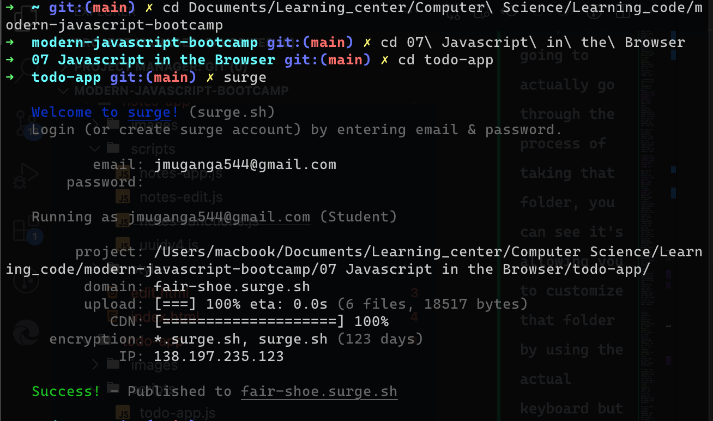

## Topic
### Section Intro App Theme
At this point in the course, all of our apps are functionallly complete but obviously they look a bit deadful.

In this section we're going to switch that up. So theere are two goals in this section. The first is to integrate a theme for each of the application, I put together three themes one for each app. I'm going to walk you through the process of integrating it. 

That's going to take us from an unstyle application to a style of application that you feel a bit more confident to actually sharing.

The second thing we're ging to do is give you a way to actually share your work by deploying our applications to the Web. So you're gong to cmae up with a real URL, you can give that URL out to anybody with an internet connection and they're going to be able to view your app and actually use it.

## Keywords & Notes
### CSS at Glance
Before we integrate any of the themes that I've set up with our applications I want to go ahead and give you a quick crash course on CSS. 

We're going to look at the very basic of CSS and how it works. The goal of this section is to give you a high level overview of how exactly it works. So the integration of the theme makes a bit more sense and doesn't seem like magic.

We're going to kick things off by going to hangman directory on `section 10` and adding some new stuff into the mix.

The first thing we're gong to add is a new file a CSS file and that's where we're going to define all of these styles that style our application.

For example changing the color of the text to read or changing the background of the browser from white to gray.

All of that would be done with `stylesheet`.

So we're going to go head and create a new folder inside of `hangman` and I'm going to call this one `scripts` Now the reason that I am creating these scripts directory and putting all of our scripts inside of it, is to clean up the file structure for our hangman application.

We're about to create a new file type CSS and I don't want everything sitting in one folder. Instead we're going to organize things a little bit.

Adding another folder for style. This is going to be called style, this is where are are going to define our `CSS` to style the app.

Let start by writing a dummy css to style the text color on how application

```
body {
    color:red;
}
```

The style above, is not going to be applied on our page, cause we're not linking the file with our page. To fix this, you must add <link> tag `the link tag allows us to link an external resource` such as a stylesheet and there are couple of attributes we need to set up to specify exactly that it is a stylesheet and were it lives to specify where the stylesheet lives.
```
<link rel="stylesheet" href="./styles/styles.css">
```

`rel=` stand for `relationship` is for defining the thing we're linking is of a certain type and in this case is the `stylesheet`

`href=` the source of the lives, in other words where this file lives.

When we first explored `selectors` with querySelector() and querySelectorAll(), we found that we could select by `tag name`, we could select by `id`, we could select by a `class` or a combination of the three.

So right here we could go ahead and select all paragraph element in the document by just using p`

```
p {
    color:red;
}
```

Tagging the button

```
button {
    color:white;
}
```

`Tag Selector` it's going to make up a small portion of our style rules but a lot of the styles rules are going to be targetting by `class` some by `id`

Tagging by `id`

```
#puzzle {
    color:red;
}
```

Tagging by `class`
```
.warning{
    color:white;
    background:red;
}
```

One of the last thing I want to cover is how we can set up a rule to have multiple selector.

```
#puzzle, button {
    color:red;
}
```
Now it's important to know that, what we have up above, is not conditional logic using `and`, it is conditional logic using `or`. So we're going to give the color red to any elemennt who has an `id of puzzle` or any element which is `button`.

If I wanted to select by both I would have to put `button` infront of our `id selector`

```
button#puzzle{
    color:red;
}
```

In this section we took a look on the basics of CSS, we figured our how we can link a file in to our Website and we also looked at how we can work with style rules.

We learned that a rule is made up of a set of selectors as well as a set of style declarations.

### Setting Hangman Theme
In this section we're going to style the hangman application using the theme that I've set up.

There are going to be a few steps to get this done. The first thing we're going to do is grab and explore the CSS theme. 

Then once we have the theme code inside of our CSS file, we're going to need to make changes to HTML file, if the CSS file sets up a class for warning. We have to actually use that class for the styles to be applied.

So we'll be making some small structural changes to the HTML file as well.

That last thing we'll end up doing is modifying one of our javascript files to conform to the setup that the theme expects.

So let's go ahead and kick this off by grabbing the theme code and exploring it to see at a high level, what it does over.

```

* {
    box-sizing: border-box;
    margin: 0;
    padding: 0;
}

html {
    font-size: 62.5%;
}

body {
    background: #2B292E;
    color: #fafafa;
    font-family: Helvetica, Arial, sans-serif;
    font-size: 1.6rem;
    display: flex;
    align-items: center;
    justify-content: center;
    min-height: 100vh;
}

span {
    border-bottom: 1px solid #534f59;
    display: inline-block;
    font-size: 2rem;
    height: 2.4rem;
    line-height: 2.4rem;
    margin: 0 .1rem;
    text-align: center;
    text-transform: uppercase;
    width: 2.4rem;
}

p {
    font-weight: 300;
    margin-bottom: .8rem;
}

.puzzle {
    display: flex;
    margin-bottom: 4.8rem;
}

.button {
    background: #7044a0;
    border: none;
    border-bottom: 2px solid #603a88;
    cursor: pointer;
    color: white;
    font-size: 1.4rem;
    font-weight: 300;
    padding: .8rem;
    transition: background .3s ease, color .3s ease;
}

.button:hover {
    background: #5F3A87;
}
```
In CSS file this file starts with some generic selectors that aren't targeting classes or IDs. These are just tags selectors like `HTML body(html)`, `span` and the universal selector(`*`).

The first nine line just override browser defaults.

```
* {
    box-sizing: border-box;
    margin: 0;
    padding: 0;
}
```

So all browsers have their own set of defaults and all we're doing here is we're trying to start from a unified place, so our styles that we apply actually look standardized.

If browsers start off various spacing sizes each browser being a bit different I'm never going to get user interface to look the same. So all we're doing here is we're starting from a nice clean.

Correctly centering things has to do with our body selector the `body selector` ses up quite a few rule definition down below.

```
body {
    background: #2B292E;
    color: #fafafa;
    font-family: Helvetica, Arial, sans-serif;
    font-size: 1.6rem;
    display: flex;
    align-items: center;
    justify-content: center;
    min-height: 100vh;
}
```
Using CSS flex box, were able to center the element inside of the body. Here we are making it a single `div` which is why we have our centered content the content. We are making it a single div which is why we have our centered content the content inside of their stacks as we normally do by default which is top to bottom. That's what we saw, when we didn't have any styles applied.

```
  <div>
        <p id="puzzle" class="warning"></p>
        <p id="guesses" class="warning"></p>
        <button id="reset">Reset</button>
    </div>
```
All of the rules that allow us to style the button, live over in theme.

```
.button {
    background: #7044a0;
    border: none;
    border-bottom: 2px solid #603a88;
    cursor: pointer;
    color: white;
    font-size: 1.4rem;
    font-weight: 300;
    padding: .8rem;
    transition: background .3s ease, color .3s ease;
}
```
`transition` is what allow us to smoothly switch between the lighter purple and the darker purple. So you can see it fades in as opposed to just jumping from one to the other

Changing the selector of puzzle from `paragraph` to `div`. CSS rule of puzzle

```
.puzzle {
    display: flex;
    margin-bottom: 4.8rem;
}
```

Now let's go ahead and customize some Javascript code. The only file we need to change is `app.js`. And the only part of `js` we're going to change is `render function`.

```
const render = () =>{
    puzzleEl.textContent = game1.getPuzzle()
    guessesEl.textContent = game1.getStatusMessage()
}
```

The first line of this function adds the text content into the puzzle element which is currently why we're seeing it showing up, instead of doing that though, we're going to start with actually clearing the element.

What we're going to do is store each HTML inside of it so we can clear all HTML inside the puzzle element using innerHTML.

```
const render = () =>{
    puzzleEl.innerHTML = ''
    guessesEl.textContent = game1.getStatusMessage()
}
```

This is where we are going to manipulate what actually goes inside of the puzzle element.

```
const render = () =>{
    puzzleEl.innerHTML = ''
    guessesEl.textContent = game1.getStatusMessage()

    game1.getPuzzle().split('').forEach((letter)=>{
        const letterEl = document.createElement('span')
        letterEl.textContent = letter
        puzzleEl.appendChild(letterEl)
    })

```

If we go to our CSS we can see where our CSS live.

```
span {
    border-bottom: 1px solid #534f59;
    display: inline-block;
    font-size: 2rem;
    height: 2.4rem;
    line-height: 2.4rem;
    margin: 0 .1rem;
    text-align: center;
    text-transform: uppercase;
    width: 2.4rem;
}
```
Creating Title in html page and favicon

```
<head>
    <meta charset="UTF-8">
    <meta http-equiv="X-UA-Compatible" content="IE=edge">
    <meta name="viewport" content="width=device-width, initial-scale=1.0">
    <link rel="stylesheet" href="./styles/styles.css">
    <link rel="icon" href="./images/favicon.png">
    <title>Hangman</title>

</head>
```

### Setting up Notes Theme: Part I

Now that we have these styles for hangman application in place, let's go ahead and move on to the `Notes application`, which is a vastly more complex app.

The notes application has way more content on the page and there are actually two pages that we are going to work with.

Naming convention in CSS
```
BEM (block, element, modifier)

Block     ->  house
Element   ->  house__kitchen
Modifier  ->  house--condo

*/
```
`Block` is a high level contract I might use a block for a letter for example a big container on a page

```
<header class="header">
            <div class="container">
                <h1 class="header__title">Notes App</h1>
                <h2 class="header__subtitle">Take notes and never forget</h2>
            </div>
        </header>
```

`Element` is just a piece of block. So for that matter we have a piece of the block called `title` and `subtitle` for a house, I might have piece of house referred to as the kitchen, so here we have the original block name followed by two underscores to signify it's an element followed by the element name.So in this case we have a `house__kitchen`

`Modifier` we have a `house--condo`. So there are a lot of different types of house. They probably all share some attributes but each version might want something a little bit different. I might have a condo in which case I might not have my own roof, it might be the building's roof or I might have a different type of house like a row home in which case  I am attached to neighbors on both sides.

So we create a modifier by adding `--` folowed by some sort of name for the modifier. In this case `house--condo` gets the job done.

### Setting up the Notes Theme Part II

### Setting up the Todo Theme Part I

You can noteice that the icon is still the icon from the old application even though the New is clearly purple, This is just due to a bit of caching that's taking place in the browser. After a little while or while switching to private mode you will see that the correct icon is actually the one you are hoping for.

You can always cash but that icon by adding something dynamic on the URL, like a query string which isn't going to affect how the images is loaded but it is going to make it a unique URL, so the cached version won't be used `?v=1`. 

```
<link href="images/favicon.png?v=1"> rel="icon"
```

So this is a handy technique for when you're going local development and you just want to make sure things are actually working even through you have some stuff cached.


> Note Technique
Now when we have a property whose values comes from variable with the exact same name. We can use the ES6 object definition shorthand and we can set it up just like this.

```
const text = e.target.elements.text.value.trim()

todo.push({
    id: uuidv4,
    text:text,
    completed:false

})
```

Insteade use, note text in a object.

```
const text = e.target.elements.text.value.trim()

todo.push({
    id: uuidv4,
    text,
    completed:false

})
```

### Hosting Your Application 
In this section we're going to explore some options for hosting your websites and we're actually going to go through the process of using two of those to get two of our apps up.

Now the nice thing about what we have here is that we have `static websites`. These are just a collection of static files. We save the files into the foler and all we need to do to run the website is to have all of these files in some directory and serve it up locally, we are serving it up with the live server program.

When we give it to a actual hosting platform they're going to serve it up using their own infrastructure.

So all we really need to do is copy the contents of any three of these folders over to a web server. And that's pretty much the only thing we have to do to deploy.

So let's start off with some more generic options.
* The first one I want to talk about is [hostgator](https://www.hostgator.com/) which I used in the past they ahve pretty good support. It's really easy to get up with. These guys are great if you're `looing to get your own domain and do some static hosting`. They have a pretty good set of services at a pretty cheap rate.

* Something very similar to `hostgator` is [blue host](https://www.bluehost.com/content/bluehost/en), they have the same pricing, those are competitors. They also do great static hosting and you get a domain when you sign up.

But neither of those services have a free trial where you can actually use them without entering some sort of credit card.

* [netlify](https://www.netlify.com/)
* [surge](https://surge.sh/)

The first one is [netlify](https://www.netlify.com/) and the other one is [surge](https://surge.sh/), both of these make it dead simple to actually get your static websites served up. And the nice thing is that they have a reasonable `free tier` so we can get our websites up for free, and then if we want more advanced features like HTTPS or some other fancy features they offer those just at a paid price so it's a great way to get started.

Both of these services do require you to actually sign up they are completely free and they don't require a credit card to sign up. All you have to do is sign up with your email.

> Point to note
Inside console, we're getting a warning about trying to `load mixed content`, this comes up when you're trying to load `HTTP content` on an `HTTPS site`, or `HTTPS content` on an `HTTP site`. Either way we want those thing to match.

In our case we have an `htttps site`(this is secure) we are making a request to `http content` (this is not), so it's not going to actually let us make that request.

We can make a small change though over inside of our code to fix this.

There is another service that I want to talk about very similar but with a slight twist that is called `surge`.

`Surge` is awesome because there actually isn't a web interface. We do everything from the command line.

We can create an account log in and then we can go ahead and push our changes up to their servers.

Remember way earlier in the course when we used the NPM command to actually install live server which we've been using throughout the course what we're going to use that same NPM command to install something. We're going to be installing these `surge software instead of the live server software`.

```
npm install -g surge
```
When we run this it's going to go through the process of installing surge. Then we're going to be able to use `cd` to change into one of our application directories and actually serve it up. We've already served up notes and hangman. So let's go ahead and use surge to deploy the todo app. I'm going to use `clear` to just clear the terminal output and all we need to do is to run `surge`.

```
surge
```

I'm going to run the command and it's going to ask us to either `log in` or create an account. I'm going to go ahead and create account, enter email and password. When your done, it's going to actually go through the process of taking that folder, you can see it's allowing you to customize that folder by using the actual keyboard but a default is just the folder that you can the command from.

We ran the command from the right folder. So we don't have to change anything.If we hit again it's asking us to set up a domain. Once again we can't use custom domain just yet. Let's leave that as it is and if we hit enter again it's actually going to go through the process of deploying the site. And when it's done what do we get, we get a URL I can take this URL I can copy it to the clipboard I can head over to the browser open an new tab and pase it.



[Todo App](https://fair-shoe.surge.sh/)

So working with surge command line tool is really really nice and makes it supper easy to get your local static site deployed on the web and these surge software comes with an extensive list of commands, we can use to do anything that we would be able to do from a web interface.

If we clear the output we can run `surge --help`. And this is going to print a bunch of outputs and documentation on how we can use it down below.

So there we have it, in this video we covered a few different ways we can deploy our applications. If you're more inclined to use the command line `surge` is a great free way to go. If you want a simpler web interface I recommend checking out and using `netlify`, find both of them come with nice generous free tier you can always upgrade to more advanced features, when you're ready.

We not only know how to make meaningful applications with javascript. We also know how to get those application live on the web so we can actually share them with others and they can use them as we add new features we can redeploy to make sure that users can always access the latest.
## Summary

