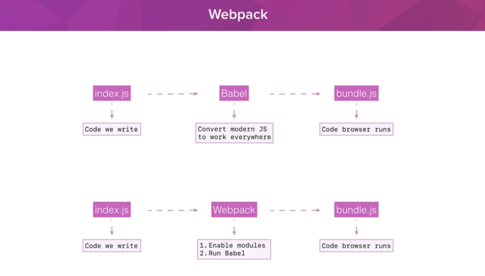
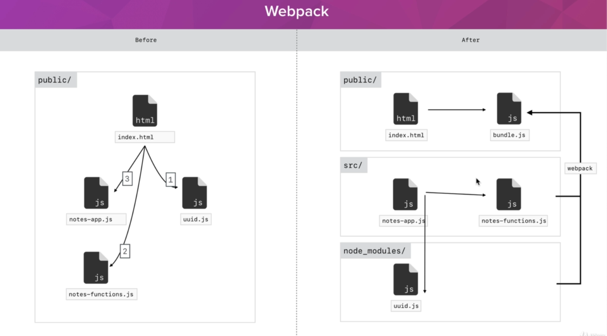
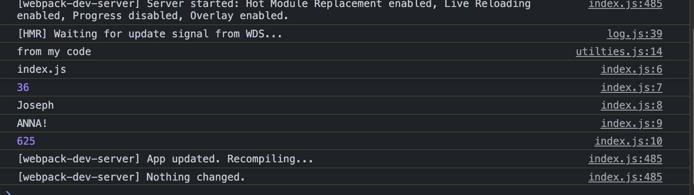

## Topic

In this section we will be primarily going to be focusing on two tools `Babel` and `webpack` which are going to open up a world of new features for us to use.

`Babel` is going to ensure that our applications work in a wide a range of browsers as possible even older browsers that are no longer being updated to support the latest cutting edge javascript features.

`Webpack` is going to open up a whole bunch of new features for us to use the biggest and best being the javascript `module system`.

This gives us a brand new way to structures our application code and I'm super excited to show you want it can do.

## Keywords and Notes

### The Problem Cross-Browser Compatibility

The goal of this section is to introduce a few new tools that are going to make it possible for our application to function in a wider range of browsers.

Like much older browsers that don't support the newer features or taking advantage of in this modern javascript bootcamp.

Illustration an example of this cross-browser incompatibilities. This video is all about exploring the problem. The rest of the section is all about the solution.

Let start with the really easy one, we're going head over to the browser and Google `mdn const`. Down below you can see `Browser compatibility Table`

So this browser incompatibilities for a feature is going to be big problem for us if we want to write modern javascript code and have our applications work everywhere. We are going to need to introduce a bit of tooling that tooling that we're going to introduce is going to solve those two key problems.

The first problem `older browsers` are never going to update to support these newer features, so if ew want to use them which we do we have to figure out a way to work around that which we're going to.

The second problem is that there are newer javascript features out there that currently aren't supported by any browser or even the latest and greatest, so the tooling that we're going to set up is going to solve that problem too allowing us to use the most advanced, cutting edge features in the language.

### Exploring Babel

We now have a goal in mind, the goal is to create javascript application that actually work in all browser but still use cutting edge features. To get that done, we're going to be using a tool and that tool si called `Babel(babo)`

The babel is going to take our javascript code and convert it to something that all browsers understand. So if we use a fancy cutting edge feature when we're writing our script, Babel is going to convert that to a dumber feature that all browser understand and that's what's actually going to run behind the scenes. This still allows us to work with and write code using the cutting edge features but our application will work pretty much everywhere.

So let's go ahead and kick this section off by messing around with this tool in the browser then we're actually going to integrate it into our application to start.

Let's go to [babeljs](babejs.io/)

Babel takes code we write with the latest features and it complies it down into more simple code that older browsers can understand. This is exactly what we're going to be setting up and that's what I want to do next to actually be able to perform this conversion process with files locally on our machine.

So we're going to install it just like we installed live server earlier in the course.

```
npm install -g babel-cli@7.11.0
```

`babel-cli` stands for Babel command line interface. This is the version of Babel that lets us run commands from the terminal

It's actually going to go through the installation process and once it's done all I want to do is verify that things actually installed correctly by running a test command

```
babel --version
```

We now have babeljs installed on our computers and we're going to move over to Visual Studio code and actually create an input file that we can run through Babel.

Changing directory to `boilerplate folder` then create a file naming `input.js`, then change directory to that file. For here we can now use the babel command to process the input.js file, the command we're going to run it needs two piece of information. It needs to know what file we're going to use as the input and it needs to know where we want to save the output, we have to provide both of these with the command.

The first thing we provide is the name of the file that we want to use as the input. In our case the file is `input.js`. The next thing we have to do is provide the output file name. This file is a file that doesn't exit, the babel command is actually going to create it. The command below

```
babel input.js -o output.js
```

Nothing will appear on the terminal, but that indicate that the `output.js` file has already being created.

The problem here is that we've run babel but we haven't specified any of the babel plug ins we want to use, by default babel does almost nothing, if we actually want to convert constant, class and the other ES6 and ES7 features which we do we have to set up just one more thing.

What we're going to be installing is called babel preset. This is what's going to give us the functionality that we actually saw from babel over inside of the browser.

So that's going to make sure babel actually converts those ES6 and ES7 features down into regular boring old javascript that older browsers can understand.

To install this preset we're not going to be installing it as global NPM module. Instead we're going to be installing it as a local NPM module local to our project, local to the `boilerplate` directory.

Now we're going to be using `local modules` quite a bit in this section.

The first thing we have to do is set up the boiler plate project to actually be able to install local module and to do this we just need to run a single command from the terminal.

```
npm init
```

No need to change any entry, just click enter for each entry. It is will ask you a permission to create a file. It will create a file called `package.json` in the boilerplate folder and it will put the displayed content, will different `key value pair`. All we have to to is hit yes, hit enter.

Now we have a `json` file with simple configuration inside it. We're going to be using this in just a moment to store the various dependencies our project needs, one of them being that present that we're going to use.

The install another command

```
clear
npm install babel-present-env@1.6.1
```

It's going to take the module code and it is going to dump it in a new directory in the root of our project. This one is called `node modules`. This is where the installed code lives in this folder contains the module that we just installed. It is not a folder we're going to be diving into and you shouldn't change any of the code inside of there. We can click it open for a moment just to see what lives inside of there. And it is essentially a long set of directories where we have our module that we installed as well as it's dependencies.

You can just pick a random folder and click it open and see that there are more files and folders inside of there.

So this is all of the code necessary to get the `env` pre-set up and running. We were able to get all of it by installing the module.

We also noticed that inside of `package.json`, we now have that module listed in a new property called `dependencies`

```
{
  "name": "boilerplate",
  "version": "1.0.0",
  "description": "",
  "main": "input.js",
  "scripts": {
    "test": "echo \"Error: no test specified\" && exit 1"
  },
  "author": "",
  "license": "ISC",
  "dependencies": {
    "babel-preset-env": "^1.7.0"
  }
}
```

We have the module name and we have the version that we're currently depending on.

We have one brand new file called `package-lock.json` this just keeps track of the version of module we're using to make sure we don't run into any conflicts later on.

> Note!!
> You should never change anything in `mode modules`. You should never manually change anything in `package-lock.json` either. We are going to be making some changes to `package.json` throughout the course and that is perfectly fine.

Running babel command by telling it to use our brand new present tha we have just installed. `babel input.js -o` youcould have also used a `babel input.js --out-file` both of them are identical. The one is just a shorthand for the other.

```
babel input.js --out-file output.js --presents env
```

A lot of students usually mess that up and right after `presents` we're just going to provide the one present we want to use , the one we just install the `env`, you don't have to provide `babel-present-env`. All you have to do is give babel the last piece.

The run the command, we get the new output. This is modified version of our file that's going to work in a wider range of browsers.

### Setting up our Boilerplate

In the last section we learned a lot about babel, we saw how babel allows us to create javascript applications that work in a wider range of browsers even if we're using those supper modern javascript features.

In this section we are going to convert boilerplate from just a set of script in a folder to a web application that we can actually view in the browser.

> Note!!

Now the first thing I want to talk about has to do with the `node modules folder` if you remember from the last section, we never put anything inside node modules and we didn't even create it.

It was created for us when we ran `npm install` with the package we installed which happened to be `babel present-emv` package.

Now what does these means, well, that means that we're not going to be keeping `node modules` around. `Node modules` is a generated directory.

So for example if I was to give you a copy of this code I wouldn't include node modules because it takes up a ton of space, `node modules` can be rebuilt by running a single command.

Now the question is how do I get the node modules folder back so I can actually work with this project. And the answer is to run a single command, the command that you need to run is `npm install`

If you run `npm install` just like this with no package name afterwards it's going to look in your `package json file` and install everything in `dependencies`.

You don't need to specify modules or module version because all of that lives in package. This makes it really easy to pass our projects around, when I you a zip, I don't have to give you a `huge node modules folder`. You can get that back by seeing changing directory to `boiler plate folder` and running `npm install`.

Now the next thing I want to do has to do with the directory structure. So what we're going to do is create two folders. The first folder inside the `boiler plate` it will be called `public`. So we still need a public folder that contains everything we want to serve up to our web server.

The second folder that we're going to create inside of boilerplate is going to be called source, `src` for short, inside here we're going to put our javascript code before it was processed by `babeljs`, inside `public` we are going to put the javascript code that was processed by babeljs because remember things that are in public are the things we use for the application, and in this case we want to use this `output.js` file for our web app so it works in a wider range of browser.

So `src folder` will contain all the file which are original file, before conversion. For example `input.js`

The next thing we're going to do inside of public is create a new folder called `scripts` and this is where we're going to dump the `output script`.

So all of the code we type lives inside of the source folder. Then the babel output gets dumped inside of the script folder. So it can actually be used by the web application.

Before we go ahead and run the `babel script again` I'm going to change the name of `input.js` and `output.js` to make the last section easier to follow. But in the real world I would most likely call this file `index.js` as the starting point for our app.

So we have `index.js`, this is the file we now want to run through Babel. So let's go ahead and explore how we can set up the modified version of our previous command. so we are still going to start with babel like we had before.

```
babel src/index.js --out-file public/scripts/bundle.js --presents env
```

Now if you're like me you're probably pretty sick already of writing this command out in the terminal.

So the next thing I want to do is give you a better way to run scripts when you're just going to be typing the same thing over and over again like we would be here.

This is using these scripts property in `package.json`, what we are going to do is copy the command exactly as we have it above. So I'm going to take this and copy this to the clipboard and then I'm going to move over into package.json

```
{
  "name": "boilerplate",
  "version": "1.0.0",
  "description": "",
  "main": "input.js",
  "scripts": {
    "build": "babel src/index.js --out-file public/scripts/bundle.js --presents env"
  },
  "author": "",
  "license": "ISC",
  "dependencies": {
    "babel-preset-env": "^1.7.0"
  }
}

```

> Note | scripts

```
"scripts": {
    "build": "babel src/index.js --out-file public/scripts/bundle.js --presents env"
  }
```

Now we can run this long command over and over again using this shorthand `build`, let's see how we get that done from the terminal right here.

```
npm run build
```

The good new is that we can make a small change to our scripts to actually have babel watch for changes. So let's go ahead and explore how to set that up, over `package.json` all we have todo is add a new option. so right at the very end of this script, we are going to add a space then two hyphens followed by watch. When we add on and watch it is not going to jus run babel once it'g going to run babel once then it is going to watch the input for changes when the input changes. When the input changes it is going to rerun babel and generate a new out file.

```
{
  "name": "boilerplate",
  "version": "1.0.0",
  "description": "",
  "main": "input.js",
  "scripts": {
    "build": "babel src/index.js --out-file public/scripts/bundle.js --presents env --watch"
  },
  "author": "",
  "license": "ISC",
  "dependencies": {
    "babel-preset-env": "^1.7.0"
  }
}

```

When we add on watch, it is not going to just run babel once it's going to run babel once then it is going to watch the input for changes when the input changes, when the input changes it is going to rerun babel and generate a new out file.

So with this in place we can now automate our workflow.

## Avoiding Global Modules

In this section I want to take a few moments to talk about `global modules` and how they're going to relate to a project like `boilerplate` which has its own set of local dependencies.

We're actually going to end up uninstalling all of our global modules and adding them in as a `local dependencies`.

Let's talk about why a couple of section ago, I mentioned that node modules is not a folder we need to keep around or keep track of, I can always delete it and I can reinstall it by running `npm install` which installs all of the dependencies listed in `package.json`, this is really nice because I could zip up the boilerplate project folder without node modules and I could share it with a friend. I could give them a template to start building their next web app from.

The only problem is that when that friend runs `npm install` they're not going to have everything they need to actually work with the code because they don't have `babel cli` which the project depends which is what we're using to serve up our application.

So what we want to do is add both of those as local dependencies. So when we install our projects dependencies they come along for the ride as well.

Let's get started by running two commands from the terminal. We're going to run one command to uninstall both `live server` and `babel cli`. Then we'll talk about the implication of doing that.

I can uninstall local modules with `npm uninstall`, I can uninstall global ones by adding on the `g` flag, like we do with the install command. From here we can just list out separated by spaces all the modules we want to uninstall.

```
npm uninstall -g babel-cli live-server
```

If we go ahead and run the above command, it is going to uninstall both modules. Then we're going to reinstall both of them locally. So right here `npm install` no g flag we don't want to install them globally.

```
npm install babel-cli@6.26.0 live-server@1.2
```

Now the implications of doing this are that we no longer have access to either a live server or babel from the command line something that we're currently relying on for a live server.

If I cycle back through my previous commands and go back to `live server` running the public folder this command no longer works because `live server` is no longer installed.

```
liver-server public
```

But let's go ahead and take a look at our other command. If I shutdown the other command and then restart it what happens, it seems to work it seems to be waiting for us to make a change.

```
npm run build
```

So why is live server failing while our other command is working. That is because our other command is running from a script. When we run commands from our scripts in package.json we get access to all of the dependencies as if they were installed globally so I can still access Babel from inside of the build script.

Now if I want to try to run babel from the terminal like we did earlier in the course before we added it as a script that would indeed fail.

```
babel --help
```

Well it means that we don't have to change this script at all. The build script currently gets the job done, all we have to do is add on another one for a liver server.

```
{
  "name": "boilerplate",
  "version": "1.0.0",
  "description": "",
  "main": "input.js",
  "scripts": {
    "serve": "live-server public",
    "build": "babel src/index.js --out-file public/scripts/bundle.js --presents env --watch"

  },
  "author": "",
  "license": "ISC",
  "dependencies": {
    "babel-cli": "^6.26.0",
    "babel-preset-env": "^1.7.0",
    "live-server": "1.2"
  }
}
```

Then run the serve

```
npm run live-server public
```

This is going to use the locally installed version of live server, we can see the server is up and running and I can refresh thing in the background and we can see the page is still live.

> Using local modules in this way it makes life just a little bit easier. All of the dependencies for our project live in package.json and you can run `npm install` to install all of them.

## Exploring Webpack

In this section we're going to start talking about the second tool we'll be introducing in our javascript project, this is `webpack`, is an awesome tool that opens up a world of new features for us to use.

So what we're going to do in this section is go through quick visualization to talk about exactly how `webpack` fits into the bigger picture.

Then in the next couple of sections we'll actually go through the process of installing it setting it up and using it in our boiler plate project.

Let's start with our current workflow, we have a file called `index.js` which contains the code that we actually write and add it in visual studio code.



We then pass that code through babel which converts the modern javascript into javascript that can be be executed from pretty much anywhere and babel splits out a file.

`bundle.js` this is the file that actually runs in the browser. So this is the set up that we currently have and we are currently using.

When we introduce `webpack` it's going to be very similar with a slight tweak. So we are still going to have some file that contains the code we write and we are still going to pass it through some tool, and in the end of the day we are going to get a single file back which contains all of the code that needs to run in the browser.

The difference is that `webpack` can do way more than `babel`. That's no to say Babel is a bad tool. `Webpack` is just a more flexible tool which allows us to do a few interesting things including running babel.

So with webpack we're going to continue to run babel as we already have set up. But we're also going to get access to some awesome stuff.

And one thing I want to place an emphasis on in this section is the javascript modules system, when we use the module system we get a brand new way to structure and set up our Javascript code.

I actually want to spend the second part of this section moving through a quick visualization that shows us how the `modules system` is going to change our project structure.

So right here we have the `before` webpack example and the `after` webpack example, we're currently living in the before webpack example.

We start off with public directory and in there we have our assets. One of those being HTML pages we might need in this case I'm just going to stick with one `index.html`.

We also have those javascript files we have `uuid.js`, `notes-app.js` and `notes-functions.js`. And all three of these needed to be loaded in in a specific order.

If `notes-app.js` file needs something from `uuid.js` file which it does and `note-function.js` file needs to be loaded first.So we have 1,2 and 3 ensuring that both of these files get access to the ID for function defined in here.

Now all of this creates a few problems. First up we have three script tags. That means we're making three requests from the browser to the server for a new javascript file making those requests and then waiting for our response takes time. So we want to minimize the number of requests to get down to just one single file that contains everything.

The other problem is that because the files need to be loaded in a specific order it's really hard to share code between those files. We either end up sharing too much or we share things, but in the wrong order. So if `notes-app.js` need to share something with `notes-functions.js` file it actually can't. Because `notes-app.js` file is `3` and `notes-functions.js` is `2` and we might accidentally expose something from `notes-functions.js` that we didn't really want `note-app` to have access to.

This can create problems when we're defining the same variable name across our files and running into issues.

So we're going to be able to leave all of this in the past after we introduce `webpack` with `webpack`. With webpack our files is going to look a bit different.

The first thing I notice is that we have three directories we have `public folder` still and this is where our `index.html` file is going to live and then we also have a `source folder` and `node modules` folder.



The source folder `src/` is going to contain all of the javascript code that we write, `node modules` is going to contain all of the `third party application code` we need. So we still have the same three files, the're just structured a bit differently.We have the app file and the functions file in the `source directory` and `uuid.js` is going to live in node modules.

We'll talk about how to set all of this up in the next several section, in this section we're just visualizing how this would work.

Now from here wha't going to happen, well our files still need to communicate. So one of these two files `notes-app.js or notes-functions` might need access to `uuid.js` and the `notes-app.js` files might need access to something from `notes functions`.

With modules system in place, any file can try to import something from another file and any given file can export something specific. So `notes-function.js` file could export a function called `get-notes` or `save-notes`. This file could then import that function and actually use it where needed.

So we would have some arrows like the above showed, that `notes-app.js` can access things from the other files in controlled and structured way. The `notes-app.js` file specify what they want to expose and `note-function.js` specifies what it actually needs.

Now how is all this work. Well it all works because of webpack. Webpack is going to take all of our assets, it's going to bundle them up into a single file called `bundle.js` and this is going to give us access to this `module's` system which is what we're going to explore in the next section. In the end of the day all we need to do is load in a single script with a single script tag.

So with webpack we're going to be able to reduce the number of script tags making our application faster.

We're also going to be able to reduce the weird ordering in order to share code between our files with the `new import export system`, we're going to have a much better way to structure things.

Excited to get in other weeds with webpack and start installing it and setting it up.

## Setting up Webpack

In this section we'll learn how to install webpack into the boilerplate project and you're going to learn how to configure it to work with our project structure.

This is going to give use access to all sorts of awesome stuff like the javascript modules system which is very exciting.

Before we dive into anything and install webpack. I want to show you where webpack lives on the web. And the one page that I want to point out ont his website is the documentation page. The documentation page is basically an entire website on its own.It outlines everything that webpack can do. Incase you want to dive deep, just read the documentation.

[Webpack documentation](https://webpack.js.org/concepts/)

In this section we're going to come up with the most basic configuration necessary to get webpack to work. Then throughout the section we'll be adding more things to our well-packed configuration to enable new features, to kick things off, we do need to install webpack in our project, it's an npm module.

So let's go ahead and move in to the terminal. We are going to use a control C to shutdown the server script, then we are going to use `npm install` to install two new modules.

Now I'm leaving off the g flag because we want to install these as local modules and not global modules. The first one is `webpack@4.5.0` and the second one is `webpack-cli@2.0.14`.

```
npm install webpack@4.5.0 webpack-cli@2.
0.14
```

After installing, we're going to go ahead and move over to Visual studio code and we're going to create the configuration file that webpack needs.So in the end of the day we're going to be running a webpack via a script just like we run babel via a script.

We can actually go ahead and create that script right now, the script name itself can be whatever we want.

```
"webpack": "webpack"
```

Now you'll notice this is similar to running babel without any of the arguments, webpack actually allows us to create the separate configuration file. So we don't have to define a really long command here. Instead we can create a javascript file and we can set up an object that defines all of the thing like where the code lives, what we want to process and where we want to save the processed code.

So let's go ahead and knock that out by creating a new file. This file needs to live in the root of your project and its name it needs to match up exactly with this `webpack.config.js`, and this is where we configure webpack specifying the details of our project.

The code we put in this file is eventually going to get processed via `node.js`. So we actually need to take advantage of a couple of node specific features which I'll walk you through. So bear with me through this webpack configuration.

The big picture goal is to create a configuration object and we actually define this object on `module.exports` is specific to `nodejs`. This is how we can expose something from a given file, and in this case we are exposing the configuration object right here inside of the object, inside the object we can now start providing the configuration details for our purposes, to get the basic configuration in place, we have to specify the input and the output, the input also known as the entry, for webpack is going to get defined first.

So we are going to setup our first property on the object entry and we're going to set entry equal to string. This string is relative path to the place where our code lives. So for us this is inside of the source directory and the file is called `index.js`

```
modules.exports = {
  entry: './src/index.js'
}
```

We have half of the configuration down, webpack now knows where to find the code to process. The only thing we have to still specify is where to save the processed code. We can now add a second property onto our configuration object. This one is called `output` and output actually doesn't get set equal to a string, it gets set equal to an object since there are a lot of different things we can configure about the output, for our purpose we are going to configure just one path and path get set equal to a string, it contains the path to where we want to save the webpack output.

So for us we want to save it in the public scripts directory.Now there is a catch what goes inside of the path value needs to be an absolute path unlike entry which can be a relative path, the absolute path needs to start from the root of our hand drive and navigate all the way to the correct location.

```
modules.exports = {
  entry: './src/index.js',
  output: {
    path: '/Users/macbook/Documents/Learning_center/Computer Science/Learning_code/modern-javascript-bootcamp/13 Cutting-Edge JavaScript with Babel and Webpack/boilerplate/public/scripts'
  }
}
```

`/Users/macbook/Documents/Learning_center/Computer Science/Learning_code/modern-javascript-bootcamp/13 Cutting-Edge JavaScript with Babel and Webpack/boilerplate/public/scripts` This is a absolute path, it start the way from the root of my hard drive and navigate into my user folder untill to the specified location.

The problem is that this path is subject to change. If I take the boilerplate project and move it from this folder to my documents folder for example the path is going to change. If I share this with a friend whose user name isn't `Andrew` the path is going to change. So we don't want to define this string right inside of here because that's not very flexible it's pretty much going to break any single time we change the location of the project or someone else works on the project with us.

What we want to do is provide an absolute path that's a bit more flexible. Luckily `nodejs` gives us good way to get this done. The first piece of puzzle is nodejs global variable. It's `__dirname` and this provides the absolute path to the root of your project. So for our purposes with the `webpack.config.js` it's going to provide this portion of the path all the way from the root of the hard drive up to the `boilerplate` folder so we can get all of the stuff that's subject to change with the name variable.

All we need to do then is tack on `public/scripts` which is never going to change because it's all part of the project structure and `public/scripts` portion is going to be the same regardless of where the project lives on my folder or if I share it with someone else and they're on a different operating system or have a different user name.

Now the value for path is not going to be a simple as `just taking __dirname`and concatenating something on like for example forward slash public forward slash scripts `path: __dirname + '/public/scripts/`, this isn't going to work because of cross operating system issues with path's windows, linus and Mac, have different systems or working with those paths. We need a universal way to get this done, nodejs give us few functions that allow us to get this done up above.

We need to explore one more node feature. What we're going to do is create a concept called `path` we're then going to load in one of the libraries that nodejs provides, this library gives us whole bunch of utility methods for working with paths, we can combine two paths in a universal way to get this, we use the require function and we pass to require as single argument a string and provide the name of the library, we would like access to the one that we're going to be accessing is called `path.

So now we have access `const path = require('path')` to this library path.`path` is just an object with a bunch of methods, on it down below, we are going to use one of those methods, it is `path.resolve` which is going to allow us to combine those two pieces to come up with the final absolute path.`path: path.resolve()` inside the resolve methods we pass two arguments, the first is `--dirname`, the second argument is `public/scripts/`, and there we go.

```
const path = require('path')
modules.exports = {
  entry: './src/index.js',
  output: {
    path: path.resolve(__dirname, 'public/scripts')
  }
}
```

We now have an absolute path that's going to work in all operating systems and with this in place we actually have our basic configuration all set up.

We can go ahead and save the `webpack.config.js` file and we can save `package.json` and we're going to go ahead and move into the terminal and actually run that webpack script to kick things off.

Then we are going to run webpack

```
npm run webpack
```

The above command is going to run webpack and we're going to get a whole bunch of confusing output. So in the end of the day what happened here is a successful build webpack was able to run correctly and it actually created a new file in our project this file lives in the folder we specified and by default it's called `main.js`

When we open `main.js`, you can see that webpack has done a few really nice things for us. The first thing it's done is it has minimized all of our code making it as small as possible. This makes it very difficult for humans to actually read it but it makes thing much faster when a computer is processing it by reducing the total number of characters in the file.

The codes from `main.js` is the code that we're going to end up running from the browser. Now with this code we have access to the modules system and that's what we're going to explore in the very next section.

Before we go and dive into that I do want to show you how you can change the name of the file that's spit out over in webpack.config.js, we can add another property to the output object along

```
const path = require("path");
module.exports = {
  entry: "./src/index.js",
  output: {
    path: path.resolve(__dirname, "public/scripts"),
    filename: 'bundle.js'
  },
};

```

## Javascript Modules Part 1

That we now have webpack all set up. In this section we're going to start taking advantage of what web pack actually offers us, one of the main things it offers is the javascript module system which gives us a better way to structure our application, so that what we're going to spend the next couple of video talking about.

Now the good news is that we don't need to install anything new or change our configuration at all.

We're going to spend all of our time working with files in the source directory. We're going to work with `index.js` and we're going to create a new file as well.

The whole point of the module system is to give us a better way to structure and build out our javascript applications in the past if I wanted to have one file, use a function defined in a different file, we had to load in multiple files with multiple script tags and we had to load them in a specific order.

No longer is that going to be the case with web pack, we always just have one file coming out, this contains everything needed to run our application and we only ever loaded in with a single script tag. Even though the underlying application might have multiple scripts.

So let's go ahead and demonstrate how this is going to work by creating a second script in the source directory `utilities.js`

```
run live server (npm run server)
run webpack(npm run webpack)
```

Now after running webpack, we can notice that the only file being loaded is the `src/index.js` file. Nowhere in this output do I see anything about my ew `utilies.js` file.

That's because when web packs starts it starts with the entry point. Our entry point `index.js` gets loaded, `index.js` doesn't specify that it needs anything from any other files so no other files actually run.

now the solution is to no change web pack configuration at all. The solution is to use the javascript modules system. It gives us new two things, we have the `import statement` and the `export statement` and the import statement can be used to grab something from another file.

So `index.js` can use `import` to grap a function or a variable from some other file, the `export statement` can be used to export something from a file. So we can export function from `utilities.js`, that gets used over in `index.js` databasese allowing us to share code between those files.

Currently there is nothing to grap from `utilities.js`. All we're going to do is use the `import statement` to get this file to run so we can actually see it's `console.log printing` int eh browser to do this, we're going to add an `import statement` into `index.js` and import statements start off with the `import` keyword.

Now when it comes to our import statements with web pack we can actually leave off the file extension. They're completely option.

```
//index.js
import './utilties'

console.log('index.js')
```

Then run webpack `npm run webpack`

```
//webpack ouput

cacheable modules 73 bytes
  ./src/index.js 46 bytes [built] [code generated]
  ./src/utilties.js 27 bytes [built] [code generated]

```

We can see that our entry point now has two files listed `indexjs` and `utilities.js`, this is only showing up because of the `import statement` we added to our code over inside the browser. Both files are executing

```
//console log
utilities.js
index.js
```

Now you might think that to actually share code between the two files I can just create a variable in index.js and use it .

So this brings us to the first important thing to not about using the module system, each file has it's own separate scope no longer are available share between files, and `this is a good thing.`

Now this separate scope doesn't means we can't share code between files, after all that's the whole point of the module system. This does mean though that we have to be explicit about what we're exporting from one file and what we're importing from another.

Currently utilities has no exports meaning that data `index.js` is actually not going to be able to access `add` even if it wanted to.

We're going to go ahead and change that by exporting add right here.

We can create an export statement out of an existing variable declaration by just adding `export` with a space upfront.

So here we are now saying we are exporting the constant `add` we could also export `let` if we wanted to.

```
//utilite.js

console.log("utilities.js");

export const add = (a, b) => a + b;
```

You can use function add down below the export with the utilities.js.

All we're saying is that other files should also be able to access this if they need it. So now that we are explicits exporting the add function we can access it for the index.js by making a change to the import statement.

It is not enough to just import the file, we have to specify the things we want from that file.

So I'm going to go ahead and comment out this import statement and we're going to look at a different import statement that allows us to grab thing like `add`.

```
//import "./utilties";
import {add} from './utilties'

console.log("index.js");
console.log(add(2, 3));

//Expected output:
utilities.js
index.js
5
```

### Challenge

```
1. Create new file called scream.js
2. Export a 'screams` function that takes a string
   a. Convert that string to upper case
   b. Add "!" onto the end
3. Import scream into index.js and use it.
```

```
//utilities.js
console.log("utilities.js");
export const add = (a, b) => a + b;
export const name = "Andrew";

//screams.js
export const screams = (string) => `${string.toUpperCase()}!`;


//index.js
import { add, name } from "./utilties";
import {screams} from "./screams"

console.log("index.js");
console.log(add(2, 3));
console.log(name);
console.log(screams('joseph'))

Expected output:
utilities.js
index.js
5
Andrew
JOSEPH!
```

## Javascript Modules Part II

In this section we're going to continue to talk about javascript modules as there are few other ways we can use both the export and import to better structure and set up our files.

The first thing I'd like to talk about are the two different styles of exports available to us because currently we're only using one of the two styles.

The first style we have `named export`. This is what we're currently using. And the other style is the `default export`.

Now a `named export` is exported like we've seen already. It has a specific name assigned to it and them we want to `import it`, I have to import it by that name.

```
//utilities.js
export const add = (a, b) => a + b;
export const name = "Andrew";

//index.js
import { add, name } from "./utilties";
import {screams} from "./screams"

console.log("index.js");
console.log(add(2, 3));
console.log(name);
console.log(screams('joseph'))
```

So above I have `add` and `name` exactly as they appear in the export. These are named exports and we can have as many of these as we need. I could have one if I just need one. I could have 40 if I happen to need 40.

The other type of export made available to us is the `default export`, all of our files can choose to have one default export should they want to. So with 'named exports`we can have as many as we need with`default exports` we can only have at most one because it's the default, so there could only be one. Down below we're going to go ahead and set up another function to be our default export.

So let's go ahead and create this.

```
//utilities.js
export const add = (a, b) => a + b;
export const name = "Andrew";
const square = (x) => x * x;
export default square

//index.js
import otherSquare, { add, name } from "./utilties";
import { screams } from "./screams";

console.log("index.js");
console.log(add(2, 3));
console.log(name);
console.log(screams("Peter"));
console.log(otherSquare(2));

//Expected output
index.js
5
Andrew
PETER!
4

```

Note: To grab the default export, we actually don't put anything inside of curly braces. Instead we put something just before the curly braces. So right here we're going to go ahead and grab the default.

```
import square, { add, name } from "./utilties";
```

Now with the `default export` we can actually call it anything we like. Because remember we're not grabbing it by its name, we're grabbing it by the fact that it is the default. So I could call this something like `otherSquare` and that would work just as well.

```
import otherSquare, { add, name } from "./utilties";
```

In either case I'm not grabbing it by its name. I'm grabbing it by the fact that it is the default.

Now if I didn't need any `named exports` and I just wanted the default export my export my import statement would be

```
import otherSquare from "./utilties";
```

Note: Run webpack to refresh the page.

Now there's no hard and fast rule for when to use a `named export` and when to use the `default export`. So I'll give you a quick guiding principle if I find myself with one big thing that a file is trying to export like a class or a function, I'll typically use the `default export` for that.

If I find myself needing to export five or six different functions or classes then I'll usually use `named exports` for all of those.

But remember this is just a guiding principle that I happened to follow. There is no wrong way to set these up. The only real rule is that you get to have at most one default export and you can have as many named exports as you need. And as we've seen you can use a combination of both, when exporting and both when importing.

The last thing I want to talk about is a different way we can set up our exports. Currently we're setting up all of our exports as we define thing in the file. There's also an alternative syntax that allows us to define all of the exports in one place. Typically the last line in the file.

```
//utilities.js
const add = (a, b) => a + b;
const name = "Andrew";
const square = (x) => x * x;

export {add, name, square as default}

//index.js
import otherSquare, { add, name } from "./utilties";
import { screams } from "./screams";

console.log("index.js");
console.log(add(2, 3));
console.log(name);
console.log(screams("Peter"));
console.log(otherSquare(2));

//Expected output:
index.js
5
Andrew
PETER!
4
```

### Challenge

```
1. Setup scream as the default export
2. Update the import statement in index.js to use it
```

```
//utilties.js
const add = (a, b) => a + b;
const name = "Andrew";
const square = (x) => x * x;
export {add, name, square as default}

//screams.js
const screams = (string) => `${string.toUpperCase()}!`;
export {screams as default}

//index.js
import otherSquare, { add, name } from "./utilties";
import screams from "./screams";

console.log("index.js");
console.log(add(2, 3));
console.log(name);
console.log(screams("Anna"));
console.log(otherSquare(25));

//Expected output:
index.js
5
Andrew
ANNA!
625
```

## Adding Babel into Webpack

In the last couple of sections we spend some time learning a new javascript feature. We learned all about javascript modules, in this section I want to get back to our `webpack config` file and talk about how we can make a change to it.

The change we're going to focus on is adding support for babel right inside of webpack.So when webpack goes through and grabs all of our code and processes it we're also going to have it run the code through the babel. So we get the best of both worlds.

We get the advantages of webpack being able to use that module system and get the advantages of Babel being able to run our code in a wider range of browsers, to get this done we're going to have to use what's known as a webpack loader, loaders allow us to customize what happens when the webpack loads a file with its module system.

In our case we're going to be able to run that code through babel. So we're going to be installing the babel loader and configuring it to get everything to work.

Inside the terminal we can run a single command to install this.

```
npm install babel-loader
```

Then we're going to have to do is add about 12 lines of code to the webpack config file to get this feature wrapped up right on the root object alongside of entry and output, I'm going to go ahead and set up another property called the `module`. This is the property that well-packed provides to us that allows us to configure the javascript module system, and webpack expects this to be an object.

```
//webpack.config.js
const path = require("path");
module.exports = {
  entry: "./src/index.js",
  output: {
    path: path.resolve(__dirname, "public/scripts"),
    filename: 'bundle.js'
  },
  module: {

  }
};
```

`rules` property allows us to specify as many rules as we want and the one rule that we're going to setup up Tells we're back to use Babel, so rules expects to be an array and it expects to be an array of objects where each object is a rule. In this case we just want one rule to use Babel. So we only need one object in this array, right here on this object is where most of the configuration is going to happen on this object.

```
//webpack.config.js
const path = require("path");
module.exports = {
  entry: "./src/index.js",
  output: {
    path: path.resolve(__dirname, "public/scripts"),
    filename: 'bundle.js'
  },
  module: {
    rules:{
      use:{
        loader: 'babel-loader',
        options:{
          presets:['env']
        }
      }
    }
  }
};
```

The last thing we need to do is customize this rule object telling it which files to actually apply the rule to. We want to apply it to all javascript files from our project excluding those inside of node modules. If we don't exclude those node modules babel can be really really slow.

Slowing down our build time since that's not code we wrote there's no need to process it.

So we are going to exclude files that have something specific in their path. Now to set up the values for exclude we actually have to use a regular expression a regular expression is just a way to target string so we can see if a given string has given value inside of it.

We're going to go ahead and set this up like the following. So we use the forward slashed to create a regular expression then right inside we type the thing we're looking for, in this case we are trying to exclude all paths that have node modules anywhere inside.

```
//webpack.config.js
const path = require("path");
module.exports = {
  entry: "./src/index.js",
  output: {
    path: path.resolve(__dirname, "public/scripts"),
    filename: 'bundle.js'
  },
  module: {
    rules:{
      exclude: /node_modules/,
      use:{
        loader: 'babel-loader',
        options:{
          presets:['env']
        }
      }
    }
  }
};
```

Set up the last property that we're going to need. This is the test property, so once again this one is also going to be regular expression. So we're going to add those two forward slashes with a comma and we're going to type some stuff inside.

Now in this case we are trying to figure out if the file has `.js` on the end. No the `.` character in a regular expression has a special meaning we want to match an actual dot. So we just escaped that using a backslash.

```
//webpack.config.js
const path = require("path");
module.exports = {
  entry: "./src/index.js",
  output: {
    path: path.resolve(__dirname, "public/scripts"),
    filename: 'bundle.js'
  },
  module: {
    rules:[{
      test: /\.js$/,
      exclude: /node_modules/,
      use:{
        loader: 'babel-loader',
        options:{
          presets:['env']
        }
      }
    }]
  }
};
```

We also want to make sur that this file extension `.js` comes at the very end of the path. All we do is put a `$` dollar sign that makes sure that what comes before is a the end of the string.

So now we have a great way to target just the javascript files we've written and actually process them through babel using babel loader. We can now save webpack config and actual make sure things are working by rerunning web pack over

```
const path = require("path");

module.exports = {
  mode: "development",
  entry: "./src/index.js",
  output: {
    path: path.resolve(__dirname, "public/scripts"),
    filename: "bundle.js",
  },
  module: {
    rules: [
      {
        test: /\.js$/,
        exclude: /node_modules/,
        use: {
          loader: "babel-loader",
          options: {
            presets: ["@babel/preset-env"],
          },
        },
      },
    ],
  },
};

```

Inside the terminal

```
npm run webpack
```

The program run fine, also processing the file through babel and in the end of the day we can see everything is working as expected which is awesome. Now this also allows us to switch up `package.json` no longer do we need this script around since webpack takes care of that for us.

```
  "build": "babel src/index.js --out-file public/scripts/bundle.js --presents env --watch"

  //changing, webpack to build
  "build": "webpack"
```

## Webpack Dev Server

In this section I want to take a few minutes to talk about how we can improve our local development workflow. So currently if we're working on the application and changing our javascript files we have to manually switch over to the terminal and rerun the build script in order to actually see our changes reflected.

So we're going to go ahead and talk about how we can improve this workflow. So we never have to go into the terminal as we're developing our app. This is very similar to what we did with battle. We configure babel to watch our files for changes and rerun Babel when any of the files changed. That's exactly what we're going to be doing with webpack.

Le'ts put five seconds on the clock and dive into the five second solution. All this requires to do is add a single flag onto the webpack command. We add on hyphen watch and we're done

```
{
  "name": "boilerplate",
  "version": "1.0.0",
  "description": "",
  "main": "input.js",
  "scripts": {
    "serve": "live-server public",
    "build": "webpack --watch"
  },
  "author": "",
  "license": "ISC",
  "dependencies": {
    "babel-cli": "^6.26.0",
    "babel-preset-env": "^1.6.1",
    "live-server": "1.2.2",
    "webpack": "^5.88.0",
    "webpack-cli": "^5.0.0"
  },
  "devDependencies": {
    "@babel/core": "^7.22.9",
    "@babel/preset-env": "^7.22.9",
    "babel-loader": "^9.1.3"
  }
}

```

So what this is going to do is it is going to run web pack when we run the command. But then webpack is going to stay up and running it is going to watch any of the files that make up the bundle for changes. So in this case it's going to watch index.js but it's going to watch anything that index.js as imports. So the end result is that it is going to watch all of our source files for changes when any of them change, It's going to generate a new bundle that's going to cause a live server to refresh the browser.

So that is the five second solution. It gest the job done and it allows us a nicer workflow. No longer do we have to switch into the terminal and rerun any scripts to be able to view our application changes even we're using more advanced complex tooling like babel and webpack.

Now I want to move on to the five minute solution.It's going to require a bit more time to set up.But it comes up with its own set of advantages.

The `web-pack dev server` essentially does everything, we're already doing it in one tool. So instead of needing to run web pack with the watch flag and lives server and separate tabs `web-pack dev server` gives us a single process we can use to do both. We're going to kick things off by installing this tool then we're going to add about five or six lines of code to this file and then we'll be all done.

So let's go ahead and start by moving into the terminal and running an NPM install command.

```
npm install webpack-dev-server
```

Now once this finishes installing we're going to have to make a few changes to the `webpack config file` to get the dev server to work. There are two main things we have to provide and they both relate to us telling the dev server where I can find the content it's supposed to serve up much like we tell a live server to serve up the content in the public directory.

We're going to add a new route property onto our config object. The first of those two properties is content base , its content need to be an absolute path, that let's the dev server know where the folder you're trying to serve up lives. So with `live server` we told it was the public directory with the `dev server` it's going to be that public directory. The only difference is in how we specify it, we have to provide an absolute path and that is very similar to what we did up above for path.

```
 devServer: {
    contentBase: path.resolve(__dirname, 'public')
  }
```

Now the next property we're going to provide is `public path` the value for public path is a string, and this is where we tell the dev server where relative to the public folder web pack puts our assets, in this case it's in the scripts folder now might seem a bit redundant don't nee to provide this again, since we're already providing it up above but don't worry we'll talk about why this is in just a few moments when we start exploring some of the advantages of the dev server.

```
path: path.resolve(__dirname, "public/scripts"),
```

So right here as the value of public path is going to as below

```
 devServer: {
    contentBase: path.resolve(__dirname, 'public'),
    publicPath: '/scripts/'
  }
```

With that in place the dev server is all configured. The only thing we have to do before we can actually run it is change one of our scrips to use the correct command over `package.json`. We're going to end up redoing scripts over and over again as we learn new tools and techniques. So I'm going to start by deleting everything we have in these scripts object, and we're going to create just one script name, `dev-server`, it's value is going to be us just running `webpack-dev-server`

```
  "scripts": {
    "dev-server": "webpack-dev-server"
  },
```

Save and run the webpack dev server

```
npm run dev-server
```

> webpack config file code

```
const path = require("path");

module.exports = {
  mode: "development",
  entry: "./src/index.js",
  output: {
    path: path.resolve(__dirname, "public/scripts"),
    filename: "bundle.js",
  },
  devServer: {
    static: {
      directory: path.resolve(__dirname, "public"),
    },
    devMiddleware: {
      publicPath: "/scripts/",
    },
  },
  module: {
    rules: [
      {
        test: /\.js$/,
        exclude: /node_modules/,
        use: {
          loader: "babel-loader",
          options: {
            presets: ["@babel/preset-env"],
          },
        },
      },
    ],
  },
};

```

## Environment and Source Maps

We spend a good deal of time in this section we're working with and configuring both babel and webpack.

And that's because I truly believe they are great tools for you to be using in your applications. Even if this is your first time ever working with javascript because they allow us to use those latest cutting edge features. So thanks for bearing with me as we move through this configuration process.

And keep in mind that what we're doing here is building something that has lasting value. We're creating a boilerplate project. So when we do want to start a new web app we don't have to go through the process of configuring all this stuff again, we simply take this boilerplate directory copy and past it and we're off and running with a new project. So well yes we do have to do this once writing a webpack config file from scratch is something I almost never do anymore.

I had my boiler plate when I want to start a new project, I just copy it, sometimes making small tweaks to fit my specific needs. The good new too is that we're almost done with our webpack configuration.

In this section I finally want to address the warning we've been seeing since the very beginning. This warning is complaining about the mode option in webpack that hasn't been set. Now it gives us a little information how the modern option has not been set where webpack will fall back to production for the value set mode option to development or production to enable defaults for each environment.

So this is telling us to specify if we're trying to use webpack for development or production, development would be use on our local machine or making changes of files and we want to see those changes reflected as fast as possible. Production is something we would only run every so often when we're actually ready to get a new copy of the public folder that could put on a web server. Each comes with their own set of advantages. Obviously when we're working in development our biggest concern is being able to work quickly. So the changes get reflected as fast as possible, webpack runs really quick. When we run things in production webpack takes way way longer, about 10 times as long but that's OK because we only run production every so often. The file it spits out is smaller and more efficient. And this is what we want for production mode.

So we're gong to be using development mode when we run the dev server and we're gong to be using production when we run our other script and setting this up to actually remove this warning is super easy. Over `package.json` all we have to do is provide a command line.

```
  "scripts": {
    "dev-server": "webpack-dev-server --mode development",
    "build": "webpack --mode production"
  },
```

That's actually only have to do to tell webpack which mode we want to run in. Let's rerun our commands.

```
//development
npm run dev-server

//production
npm run build
```

For production, we're going to do the same thing with our production `build` so to generate the actual physical `bundled.js` file we need. We will run from the terminal `npm run build`. And remember we only need to do this when we're done making all of the changes for whatever new feature, we're trying to add and we're ready to get a copy of the app, we can actually upload to one of those services to change the version that people run when they visit the app in the browser. So right here we can see that things have been build and we have a physical `bundle.js` file.

Now you would be ready to take everything out of `public` put it on your wev server and you would have a new version of your production application deployed.

Now there is one more topic I want to talk about in this section and to Illustrate the problem that we're going to solve, I just want to add a `console.log` into one of our files like `utilities.js`, we can add it wherever we want it's not important.

```
//utilities.js
const add = (a, b) => a + b;

const name = "Joseph";

const square = (x) => x * x;
console.log("from my code");
export { add, name, square as default };
```

From the code above then we're going to save utilities.js and we're going to go ahead and start up the dev server once again. Once the dev server is up, we'll refresh the browser and then we can start having this discussion about the new topic. I wan tto talk about.

Down on `console panel`, we get all of the expected output. We have our console logs, from index.js, we have the one from utilities.js and we even notice that the dev tools are showing us that is shows us exactly which file the log is coming from and which line it's coming from as well.


This can be really useful information as we debug complex applications. It can be really nice to be able to find where in the code something is coming from whether it's a message like these here or an error rom something going wrong.

The only problem with the developer tools is that if we actually click one of these files it's not going to give us accurate information. So when we click that it shows our console.log on line 14 of tha file. If were to actually go over there and look for it we would realize that utilties.js doesn't even have 14 lines, the last line is line 7. So clearly while this file looks similar it's not exactly we have over here (created one) and that's because the displayed after clicking the file is the compiled file that actually runs in the browser.

This is after Babel runs through it so he can see that ad has been converted to a regular function.

Obviously we still want these things to be converted but when it comes to debugging our application in the browser dev tools it would be nice if we got more useful information. It would be nice for example if this said utilities.js line 10 which is indeed execute line 9 which is indeed accurate.

Now there is a way to do thi and it is by enabling something called a `source map`, a source map contains a bunch of information that allows the browser to map the compiled code so the code we see here back to the original source from which it come. That's going to make it way easier to work with our webpack projects using the browser developer tools and the good news is that we can set it up in webpack with a single line of configuration, over inside of the webpack config file, we're going to add a new root property called `dev tool`

```
  module: {
    rules: [
      {
        test: /\.js$/,
        exclude: /node_modules/,
        use: {
          loader: "babel-loader",
          options: {
            presets: ["@babel/preset-env"],
          },
        },
      },
    ],
  },
  devtool: "source-map",
};
```

Well and code.

## Converting Hangman App

In this section we are going to start the process of converting three javascript application over to the boilerplate project structure.

So we'll be able to take advantage of things like webpack, babel, javascript modules source maps and all of the other awesome stuff we've set up.

Essentially we're going to clone the boilerplate folder we're then going to take some of the files from older project copy them over to the new one and make few changes to take advantage of things like the javascript module system and the slightly altered directory structure for the most part through it's really not going to be that bad.

> > For example we are using things like getPuzzle, getPuzzle isn't defined in this file and we don't have access to it because with webpack each file has its own private scope. The same thing is true for the hangman class used on the very next line.

[Polyfill](https://babeljs.io/docs/babel-polyfill)The polyfill fixes that the `polyfill` runs before your code and it adds support for things like `includes function` in older browsers, the polyfill runs some code to check if the array prototype has the `includes methods` in it. If it does it leaves it alone. Knowing it's a modern browser. If it doesn't that actually defines an implementation for us.

So long story short what we need to do is include the polyfill so we get access to the function babel needs regeneration runtime. Now all we have to do is install this, make a one line change to well-packed config and we'll be all done with this conversion process.

```
npm install polyfill
```

Now the key to using the polyfill is to load it before we load our application code. That's going to require a single one line change to webpack config.

```
  entry: ["babel-polyfill", "./src/index.js"]
```

Now the polyfill is going to load before our application loads. It's going to make that function available to us and we'll be able to use async await over in the terminal.

//deployment
Now that our Local development environment is looking good. Let's go ahead and actually create a production build and deploy to production and test that out as well.

If you remember we had used those two services when hosting our websites we had used `netlify` an easy browser based way to host website and we had used `surge` as a great command line tool for
deploying applications.

//first run

```
npm run build
```

Remember we have to run this script to generate the production build. This spits out actual files to the public scripts folder. Now that we have the files there let's go ahead and move over to the browser. I'm going to pull up `netlify.com` for the Hangman game, the drag the public folder to netlify for deployment.

So here we have it. This is the process of converting our old applications to the new system where we get the advantages of webpack and babel.

## Using Third Party Libraries [UUID]

Before we convert the notes or todo application there's one more thing we need to learn about and that's how we can use third party libraries with javascript modules.

So the todo application takes advantage of the UUID for a library. We're going to learn how we can install that library via npm then load it in the import.

if you google `github uuid` that will bring us over to the library page right there [uuidjs/uuid](https://github.com/uuidjs/uuid). And we had used this page to figure out exactly how we can load in the library and run things.

If we scroll down on this page to the documentation we'll notice that one of the first things shown is `npm install uuid`. So this is exactly we're going to do to get the library installed in our project.

So, over in the terminal like we've done plenty of times before. We're going to install this library in the terminal.

So what we're going to end up doing from index.js or whatever file happen to need it is adding an import statement that imports that library code.

This is then going to allow us to use that library functionality in the specific file. So just like I import hangman in this file because I need the hangman class I would import `uuid` in this file. If I needed it here if I didn't need it here `[index.js]` but I needed it in the request file, I would add the `import` in request.js.

So we're using the javascript module system just like we've been using it already with the code we wrote. The only difference is we're loading in third part code.

So in the terminal we can see the NPM installation command did succeed. So let's go ahead and cycle through the previous commands and get the `dev-server` up and running once.

```
import { v4 as uuidv4 } from 'uuid';
uuidv4(); // ⇨ '9b1deb4d-3b7d-4bad-9bdd-2b0d7b3dcb6d'
```

I'm going to test things out down below by just using `console.log` to print a unique ID to the console. I'm going to call `uuid` for passing in no arguments sent it accepts none. I'll pass that to console.log to print it. And now we can actually start the `dev-server` again from the terminal.

```
npm run dev-server
```

Now we are actually able to see unique id. Now that we ahve installed and use one third party library I want to run through that process one more time with a library we've never used before.

Now that we have installed and use one third party library I want to runt through that process one more time with a library we've never used before. Just to give you a bit more experience. It's really essential to get comfortable working with these third party libraries because it can really save you a lot of time in the long run.

There are a lot of problems we might want to solve in our javascript app but these might be problems that other people needed to solve as well like generating a unique ID. So it's not essential for us to write all the code actually learn how those thing works, then make sure the code is working correctly and change it over time. Instead we can take this common thing generating a unique ID and we can essentially outsource it to a library like UUID.

Let's go ahead and run through just one more example with one more npm library.

Over inside of the browser I am going to search NPM the validator. This is going to pull up the validator package on npm and this is the one that we're going to be installing and using.

> Challenge import and use the validator package

```
npm install validator

//index.js
import validator from "validator";

//use it
console.log(validator.isEmail("foo@bar.com"));

//Expected output: true;
```

So being able to take advantage fo third party libraries like UUID or validator are going to allow us to foucst ont he specifics of our application and not worry about generic tasks that a lot of applications need.

So I recommend looking for third party libraries for common problems before you decide to write a bunch of code on your own.

```
//index.js
import { v4 as uuidv4 } from "uuid";
import validator from "validator";
import Hangman from "./hangman";
import getPuzzle from "./requests";

console.log(uuidv4());
const puzzleEl = document.querySelector("#puzzle");
const guessesEl = document.querySelector("#guesses");
let game1;

console.log(validator.isEmail("foo@baom")); //=> true

window.addEventListener("keypress", (e) => {
  const guess = String.fromCharCode(e.charCode);
  game1.makeGuess(guess);
  render();
});

const render = () => {
  puzzleEl.innerHTML = "";
  guessesEl.textContent = game1.statusMessage;

  game1.puzzle.split("").forEach((letter) => {
    const letterEl = document.createElement("span");
    letterEl.textContent = letter;
    puzzleEl.appendChild(letterEl);
  });
};

const startGame = async () => {
  const puzzle = await getPuzzle("2");
  game1 = new Hangman(puzzle, 5);
  render();
};

document.querySelector("#reset").addEventListener("click", startGame);

startGame();

```

So if you want to unistall the package all you have to do is to run

```
npm uninstall uuid validator
```

## Converting Notes App

So for Notes App it has two js script to control different pages, for edit page and index page, for the thing that we have to do is change the entry point on our `webpack.config.js` file, to accomodate all the pages.

```
entry:{
     index:  ["babel-polyfill", "./src/index.js"],
     edit:  ["babel-polyfill", "./src/edit.js"]
  },
```

Also we have to make some modification on the output, to for both pages the edit and index page

```
 output: {
    path: path.resolve(__dirname, "public/scripts"),
    filename: "[name]-bundle.js",
  }
```

To link the html and the js, below are the links

```
//index.html
 <script src="./scripts/index-bundle.js"></script>

 //edit.html
<script src="./scripts/edit-bundle.js"></script>
```

After that you have to run the npm to make sure all the dependencies are ok

```
npm install
```

Then run the application

```
npm run dev-server
```

## Converting Notes App Part II

In this section we will continue to convert Notes App.

Now before we actually move any files over or copy any code I Want to talk about why converting this project is going to be a little harder than it was to convert the hangman application, to kick things let's go ahead and start with `note functions` and `notes.js`

One of hte very first things `notes.app` does is it creates the notes array. So we get this value by calling `getSavedNotes` which reads data out of local storage. If there is no data in local storage we just start off with an empty array and this function has been working really well so far.

It gives us access to the notes which we can then use in this file. For example we render the notes.

But there's a problem with our current structure, that's not going to work when we introduce the module system that is the fact that this variable `notes` is being used by other files as well.

When we use javascript modules each module. So each file has it's own scope meaning that we can''t share variable between files like we're currently relying on. Instead we need to use export and import to transfer data between those files.

So we're going to do a bit of restructuring to create a better application to kick things off, let's go ahead and create a brand new file in source directory.

`/src/notes.js` This is the file that's going to be in charge of managing those notes.

So for example in here' we're going to have a notes array just like we did before then we're going to export a series of functions allowing anyone to manipulate that array whether they want to add a new item figure out what times are in teh array or remove a note by it's id.

So in the end of the day functionality is going to be the same. It's just about restructuring thing to better take advantage of the modules system.

So let's go ahead and and kick things off my creating that array.

```
//notes.js
let notes = []

/**
 * Get the notes from localStorage
 * @returns {array}
 */
const loadNotes = () => {
    const notesJSON = localStorage.getItem('notes')

    try {
        return notesJSON ? JSON.parse(notesJSON) : []
    } catch (e) {
        return []
    }
}
/**
 * Expose notes from module
 * @returns {array} notes
 */
const getNotes = () => notes

//calling the function
notes = loadNotes();

export {getNotes}

//index.js
import { getNotes } from "./notes";
console.log(getNotes())

```

So once gain we're going to create a new function in the file and export it so it can be used by the rest of the application.

In the past we didn't even have a function for creating a note. We just had a set of code inside of our event handler.

So we're going to go ahead and clean that up by breaking it into a function that we can use and reuse anywhere we need over inside of `notes.js`

`createNotes()` isn't going to need any arguments and inside of there, we're going to go ahead and do a few things. First up we're going to need to generate a new ID, using `uuid` and we're also going to have to generate a `timestamp` using moment. Neither of those are tools we currently have installed.

So before we can continue we actually need to install a couple of third party modules `[moment, uuid]`

```
npm install moment uuid
```

Now these are all modules we've worked with before so we don't have to learn anything new switching from using script tags and the old project to actual modules in the new. Let's go ahead and run that.

Below is the create notes function.

```
/**
 * Create a note
 */
const createNote = () =>{
    const id = uuidv4()
    const timestamp = moment().valueOf()

    notes.push({
        id: id,
        title: '',
        body: '',
        createdAt: timestamp,
        updatedAt: timestamp
    })

}
```

So now we have a way to read our notes and we have a way to create a new note. All of that code living nicely in `notes.js`

So let's go ahead and create another function as well. This one is going to be similar to something that we already have and it is going to be `saveNotes`. `saveNotes` is going to save the data to local storage.

Now we already have that function over in notes function.

```
/**
 * Saving notes to local storage
 */
const saveNotes = () => {
  localStorage.setItem("notes", JSON.stringify(notes));
};
```

In this section we focused on create our notes module the notes is going to contain everything needed to work with and manipulate the notes array other files are going to be able to actually manipulate the notes array by calling one of the functions this file exposes in this case we're exposing two functions, `getNotes` allowing another file to get the current notes and `createNotes` allowing other file to actually create a note.

`index.js` doesn't need to know the implementation details of either of these function. `index.js` doesn't need to know the implementation details of either of these function indexed. It shouldn't even care that local storage is being used.

All it know is that it's been given a set of function to call. It's up to `notes.js` to worry about the details of exactly where this data is stored.

## Converting Notes App Part III
In this section we're going to continue moving through this conversion process. So let's go ahead and start by bringing over another function from `notes-function.js` to `notes.js` and that is the `remove notes function`

```
removeNot("5d77d528-b1fa-496b-8b33-8fc6b5b11b11");
console.log(getNotes());
```
We can see that the removed note function is working as advertised.

Now let's continue on with a another easy one. Inside of notes function near the bottom we have our `sortNotes` function, this one is going to get copied and pasted into the new file. 

The last function we're going to add in `notes.js` is going to be one that doesn't exit already. This one is going to be called `updateNote` and it's going to give us an easy function based way to update a notes title or by or both. So currently over inside of the note edit file which I'm going to move over 
